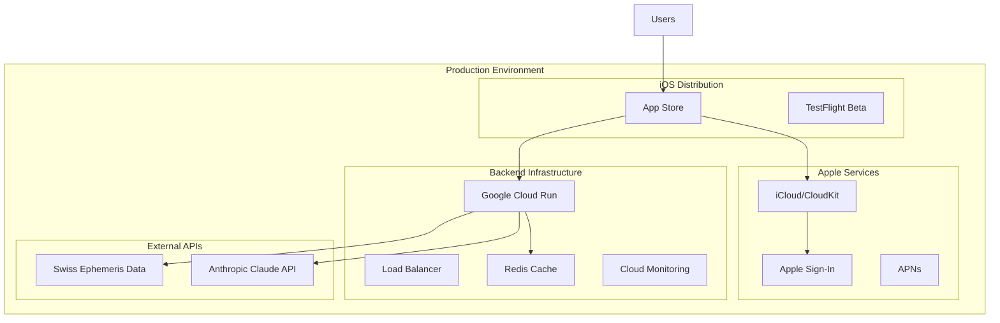

# 🚀 AstroNova Deployment Strategy

## Overview
Comprehensive deployment strategy for the full-stack AstroNova application, covering iOS App Store distribution, Python Flask backend deployment, CloudKit configuration, and system integration.

## 🏗️ Architecture Overview



## 📱 iOS App Deployment

### App Store Configuration

#### **App Store Connect Setup**
```yaml
App Information:
  App Name: "Astronova"
  Bundle ID: "sankalp.AstronovaApp"
  Primary Language: English (U.S.)
  Category: Education
  Sub-Category: Reference
  Content Rights: Does Not Use Third-Party Content

Pricing:
  Business Model: Free
  Base Price: Free
  In-App Purchases: None

App Privacy:
  Data Collection: Minimal (Birth Date, Name, Location)
  Data Usage: Personalized Content
  Data Sharing: None
  Data Retention: User-Controlled Deletion
```

#### **CloudKit Container Configuration**
```swift
// Production CloudKit Setup
CloudKit Container: iCloud.com.sankalp.AstronovaApp

Database Schema:
- UserProfile (Users)
- Horoscope (Users) 
- ChatMessage (Users)
- KundaliMatch (Users)
- BookmarkedReading (Users)

Security Roles:
- Authenticated Users: Read/Write own records
- Anonymous Users: No access
- Admin: Full access for support
```

#### **Capabilities & Entitlements**
```xml
<!-- AstronovaApp.entitlements -->
<dict>
    <key>com.apple.developer.icloud-container-identifiers</key>
    <array>
        <string>iCloud.com.sankalp.AstronovaApp</string>
    </array>
    <key>com.apple.developer.icloud-services</key>
    <array>
        <string>CloudKit</string>
    </array>
    <key>com.apple.developer.ubiquity-kvstore-identifier</key>
    <string>$(TeamIdentifierPrefix)$(CFBundleIdentifier)</string>
</dict>
```

### Build & Release Process

#### **Development Build Pipeline**
```yaml
# .github/workflows/ios-build.yml
name: iOS Build & Deploy

on:
  push:
    branches: [main]
    tags: ['v*']

jobs:
  build-and-deploy:
    runs-on: macos-latest
    steps:
      - name: Checkout
        uses: actions/checkout@v3
      
      - name: Setup Xcode
        run: sudo xcode-select -s /Applications/Xcode_15.0.app
      
      - name: Install Certificates
        env:
          CERTIFICATES_P12: ${{ secrets.CERTIFICATES_P12 }}
          CERTIFICATES_PASSWORD: ${{ secrets.CERTIFICATES_PASSWORD }}
        run: |
          echo $CERTIFICATES_P12 | base64 --decode > certificates.p12
          security create-keychain -p temp build.keychain
          security import certificates.p12 -k build.keychain -P $CERTIFICATES_PASSWORD -T /usr/bin/codesign
          security list-keychains -s build.keychain
          security default-keychain -s build.keychain
          security unlock-keychain -p temp build.keychain
      
      - name: Install Provisioning Profiles
        env:
          PROVISIONING_PROFILE: ${{ secrets.PROVISIONING_PROFILE }}
        run: |
          mkdir -p ~/Library/MobileDevice/Provisioning\ Profiles
          echo $PROVISIONING_PROFILE | base64 --decode > ~/Library/MobileDevice/Provisioning\ Profiles/profile.mobileprovision
      
      - name: Build Archive
        run: |
          xcodebuild clean archive \
            -project astronova.xcodeproj \
            -scheme AstronovaApp \
            -archivePath AstronovaApp.xcarchive \
            -configuration Release \
            CODE_SIGN_STYLE=Manual \
            PROVISIONING_PROFILE_SPECIFIER="AstronovaApp Distribution" \
            CODE_SIGN_IDENTITY="Apple Distribution"
      
      - name: Export IPA
        run: |
          xcodebuild -exportArchive \
            -archivePath AstronovaApp.xcarchive \
            -exportPath . \
            -exportOptionsPlist ExportOptions.plist
      
      - name: Upload to TestFlight
        env:
          API_KEY_ID: ${{ secrets.APPSTORE_API_KEY_ID }}
          API_ISSUER_ID: ${{ secrets.APPSTORE_API_ISSUER_ID }}
          API_KEY: ${{ secrets.APPSTORE_API_KEY }}
        run: |
          xcrun altool --upload-app \
            --type ios \
            --file AstronovaApp.ipa \
            --apiKey $API_KEY_ID \
            --apiIssuer $API_ISSUER_ID
```

#### **Release Versioning Strategy**
```bash
# Semantic versioning: MAJOR.MINOR.PATCH
# Example: 1.2.3

# Version Bump Script
#!/bin/bash
VERSION_TYPE=$1  # major, minor, patch

# Update version in Info.plist
/usr/libexec/PlistBuddy -c "Set :CFBundleShortVersionString $NEW_VERSION" AstronovaApp/Info.plist
/usr/libexec/PlistBuddy -c "Set :CFBundleVersion $BUILD_NUMBER" AstronovaApp/Info.plist

# Create git tag
git tag -a "v$NEW_VERSION" -m "Release version $NEW_VERSION"
git push origin "v$NEW_VERSION"
```

## 🐍 Backend Deployment

### Google Cloud Run Deployment

#### **Docker Configuration**
```dockerfile
# Dockerfile
FROM python:3.11-slim

# Set working directory
WORKDIR /app

# Install system dependencies
RUN apt-get update && apt-get install -y \
    gcc \
    && rm -rf /var/lib/apt/lists/*

# Copy requirements and install Python dependencies
COPY requirements.txt .
RUN pip install --no-cache-dir -r requirements.txt

# Copy application code
COPY . .

# Set environment variables
ENV FLASK_APP=app.py
ENV FLASK_ENV=production
ENV PORT=8080

# Expose port
EXPOSE 8080

# Health check
HEALTHCHECK --interval=30s --timeout=10s --start-period=5s --retries=3 \
    CMD curl -f http://localhost:8080/api/v1/misc/health || exit 1

# Run application
CMD ["python", "app.py"]
```

#### **Cloud Run Configuration**
```yaml
# cloud-run-config.yaml
apiVersion: serving.knative.dev/v1
kind: Service
metadata:
  name: astronova-backend
  annotations:
    run.googleapis.com/ingress: all
    run.googleapis.com/execution-environment: gen2
spec:
  template:
    metadata:
      annotations:
        autoscaling.knative.dev/minScale: "1"
        autoscaling.knative.dev/maxScale: "100"
        run.googleapis.com/cpu-throttling: "false"
        run.googleapis.com/memory: "2Gi"
        run.googleapis.com/cpu: "1000m"
    spec:
      containers:
      - image: gcr.io/PROJECT_ID/astronova-backend:latest
        ports:
        - containerPort: 8080
        env:
        - name: SECRET_KEY
          valueFrom:
            secretKeyRef:
              name: astronova-secrets
              key: secret-key
        - name: ANTHROPIC_API_KEY
          valueFrom:
            secretKeyRef:
              name: astronova-secrets
              key: anthropic-api-key
        - name: REDIS_URL
          value: "redis://redis-instance:6379"
        resources:
          limits:
            cpu: "1000m"
            memory: "2Gi"
          requests:
            cpu: "500m"
            memory: "1Gi"
```

#### **Deployment Pipeline**
```yaml
# .github/workflows/backend-deploy.yml
name: Backend Deploy

on:
  push:
    branches: [main]
    paths: ['backend/**']

jobs:
  deploy:
    runs-on: ubuntu-latest
    steps:
      - name: Checkout
        uses: actions/checkout@v3
      
      - name: Setup Google Cloud
        uses: google-github-actions/setup-gcloud@v1
        with:
          service_account_key: ${{ secrets.GCP_SA_KEY }}
          project_id: ${{ secrets.GCP_PROJECT_ID }}
      
      - name: Configure Docker
        run: gcloud auth configure-docker
      
      - name: Build Docker Image
        run: |
          cd backend
          docker build -t gcr.io/${{ secrets.GCP_PROJECT_ID }}/astronova-backend:${{ github.sha }} .
          docker build -t gcr.io/${{ secrets.GCP_PROJECT_ID }}/astronova-backend:latest .
      
      - name: Push Docker Image
        run: |
          docker push gcr.io/${{ secrets.GCP_PROJECT_ID }}/astronova-backend:${{ github.sha }}
          docker push gcr.io/${{ secrets.GCP_PROJECT_ID }}/astronova-backend:latest
      
      - name: Deploy to Cloud Run
        run: |
          gcloud run deploy astronova-backend \
            --image gcr.io/${{ secrets.GCP_PROJECT_ID }}/astronova-backend:${{ github.sha }} \
            --platform managed \
            --region us-central1 \
            --allow-unauthenticated \
            --set-env-vars="FLASK_ENV=production" \
            --memory=2Gi \
            --cpu=1 \
            --min-instances=1 \
            --max-instances=100
      
      - name: Update Traffic
        run: |
          gcloud run services update-traffic astronova-backend \
            --to-latest \
            --region us-central1
```

### Redis Cache Deployment

#### **Google Cloud Memorystore**
```bash
# Create Redis instance
gcloud redis instances create astronova-cache \
    --size=1 \
    --region=us-central1 \
    --redis-version=redis_6_x \
    --tier=basic

# Get connection info
gcloud redis instances describe astronova-cache \
    --region=us-central1 \
    --format="value(host,port)"
```

### Environment Configuration

#### **Production Environment Variables**
```bash
# Google Cloud Secret Manager
gcloud secrets create secret-key --data-file=secret.txt
gcloud secrets create jwt-secret-key --data-file=jwt-secret.txt
gcloud secrets create anthropic-api-key --data-file=anthropic-key.txt

# Environment Variables
export SECRET_KEY="$(gcloud secrets versions access latest --secret="secret-key")"
export JWT_SECRET_KEY="$(gcloud secrets versions access latest --secret="jwt-secret-key")"
export ANTHROPIC_API_KEY="$(gcloud secrets versions access latest --secret="anthropic-api-key")"
export REDIS_URL="redis://REDIS_HOST:6379"
export FLASK_ENV="production"
export PORT="8080"
```

## 🌐 Domain & SSL Configuration

### Custom Domain Setup
```bash
# Map custom domain to Cloud Run
gcloud run domain-mappings create \
    --service astronova-backend \
    --domain api.astronova.app \
    --region us-central1

# SSL Certificate (automatic via Google)
# Verification via DNS records required
```

### Load Balancer Configuration
```yaml
# load-balancer-config.yaml
apiVersion: networking.gke.io/v1
kind: ManagedCertificate
metadata:
  name: astronova-ssl-cert
spec:
  domains:
    - api.astronova.app
---
apiVersion: networking.k8s.io/v1
kind: Ingress
metadata:
  name: astronova-ingress
  annotations:
    kubernetes.io/ingress.global-static-ip-name: astronova-ip
    networking.gke.io/managed-certificates: astronova-ssl-cert
spec:
  rules:
  - host: api.astronova.app
    http:
      paths:
      - path: /*
        pathType: ImplementationSpecific
        backend:
          service:
            name: astronova-backend
            port:
              number: 80
```

## 📊 Monitoring & Observability

### Application Monitoring

#### **Google Cloud Monitoring**
```python
# backend/monitoring.py
from google.cloud import monitoring_v3
import logging
import time

class ApplicationMonitoring:
    def __init__(self):
        self.client = monitoring_v3.MetricServiceClient()
        self.project_name = f"projects/{os.environ.get('GCP_PROJECT_ID')}"
    
    def track_api_latency(self, endpoint, duration):
        series = monitoring_v3.TimeSeries()
        series.metric.type = "custom.googleapis.com/api/latency"
        series.resource.type = "cloud_run_revision"
        
        point = monitoring_v3.Point()
        point.value.double_value = duration
        point.interval.end_time.seconds = int(time.time())
        series.points.append(point)
        
        self.client.create_time_series(
            name=self.project_name, 
            time_series=[series]
        )
    
    def track_error_rate(self, endpoint, error_type):
        # Implementation for error tracking
        pass
```

#### **Health Check Endpoints**
```python
# backend/routes/misc.py
@misc_bp.route('/health', methods=['GET'])
def health_check():
    """Comprehensive health check"""
    status = {
        'status': 'healthy',
        'timestamp': datetime.utcnow().isoformat(),
        'version': os.environ.get('APP_VERSION', '1.0.0'),
        'checks': {}
    }
    
    # Database connectivity
    try:
        redis_client.ping()
        status['checks']['redis'] = 'healthy'
    except Exception:
        status['checks']['redis'] = 'unhealthy'
        status['status'] = 'unhealthy'
    
    # External API connectivity
    try:
        # Test Anthropic API
        status['checks']['anthropic'] = 'healthy'
    except Exception:
        status['checks']['anthropic'] = 'unhealthy'
    
    # Swiss Ephemeris
    try:
        import swisseph as swe
        status['checks']['swisseph'] = 'healthy'
    except Exception:
        status['checks']['swisseph'] = 'unhealthy'
    
    return jsonify(status), 200 if status['status'] == 'healthy' else 503
```

### Logging Configuration

#### **Structured Logging**
```python
# backend/logging_config.py
import logging
import json
from google.cloud import logging as cloud_logging

class StructuredLogger:
    def __init__(self):
        if os.environ.get('FLASK_ENV') == 'production':
            client = cloud_logging.Client()
            client.setup_logging()
        
        self.logger = logging.getLogger(__name__)
        self.logger.setLevel(logging.INFO)
    
    def log_api_call(self, endpoint, user_id, duration, status_code):
        log_data = {
            'event': 'api_call',
            'endpoint': endpoint,
            'user_id': user_id,
            'duration_ms': duration,
            'status_code': status_code,
            'timestamp': datetime.utcnow().isoformat()
        }
        self.logger.info(json.dumps(log_data))
    
    def log_error(self, error, context=None):
        log_data = {
            'event': 'error',
            'error_message': str(error),
            'error_type': type(error).__name__,
            'context': context or {},
            'timestamp': datetime.utcnow().isoformat()
        }
        self.logger.error(json.dumps(log_data))
```

## 🔒 Security Configuration

### Network Security

#### **Cloud Armor (DDoS Protection)**
```bash
# Create security policy
gcloud compute security-policies create astronova-security-policy \
    --description "Security policy for AstroNova API"

# Add rate limiting rule
gcloud compute security-policies rules create 1000 \
    --security-policy astronova-security-policy \
    --expression "origin.region_code == 'US'" \
    --action "rate_based_ban" \
    --rate-limit-threshold-count 100 \
    --rate-limit-threshold-interval-sec 60 \
    --ban-duration-sec 600

# Apply to backend service
gcloud compute backend-services update astronova-backend \
    --security-policy astronova-security-policy \
    --global
```

#### **VPC Configuration**
```yaml
# vpc-config.yaml
apiVersion: compute.cnrm.cloud.google.com/v1beta1
kind: ComputeNetwork
metadata:
  name: astronova-vpc
spec:
  autoCreateSubnetworks: false
---
apiVersion: compute.cnrm.cloud.google.com/v1beta1
kind: ComputeSubnetwork
metadata:
  name: astronova-subnet
spec:
  ipCidrRange: "10.0.0.0/24"
  region: us-central1
  networkRef:
    name: astronova-vpc
  privateIpGoogleAccess: true
```

### API Security

#### **JWT Token Configuration**
```python
# backend/auth.py
from flask_jwt_extended import JWTManager, create_access_token, jwt_required

class AuthManager:
    def __init__(self, app):
        self.jwt = JWTManager(app)
        app.config['JWT_SECRET_KEY'] = os.environ.get('JWT_SECRET_KEY')
        app.config['JWT_ACCESS_TOKEN_EXPIRES'] = timedelta(hours=24)
        
        # Configure JWT callbacks
        self.jwt.expired_token_loader(self.expired_token_callback)
        self.jwt.invalid_token_loader(self.invalid_token_callback)
    
    def create_user_token(self, user_id):
        return create_access_token(
            identity=user_id,
            additional_claims={'user_id': user_id}
        )
    
    @staticmethod
    def expired_token_callback(jwt_header, jwt_payload):
        return jsonify({'message': 'Token has expired'}), 401
    
    @staticmethod
    def invalid_token_callback(error):
        return jsonify({'message': 'Invalid token'}), 401
```

## 🚀 Deployment Procedures

### Release Checklist

#### **Pre-Deployment**
- [ ] **Code Review**: All changes reviewed and approved
- [ ] **Tests**: All unit, integration, and E2E tests passing
- [ ] **Security Scan**: Vulnerability assessment completed
- [ ] **Performance Testing**: Load testing completed
- [ ] **Documentation**: Updated README and deployment docs

#### **iOS Deployment**
- [ ] **Version Bump**: Update CFBundleShortVersionString
- [ ] **Build Archive**: Create release archive with distribution certificate
- [ ] **TestFlight Upload**: Upload to TestFlight for beta testing
- [ ] **App Store Review**: Submit for App Store review
- [ ] **Release**: Publish to App Store

#### **Backend Deployment**
- [ ] **Environment Variables**: Verify all secrets are configured
- [ ] **Database Migration**: Run any required database updates
- [ ] **Docker Build**: Build and test Docker image
- [ ] **Cloud Run Deploy**: Deploy to production with traffic migration
- [ ] **Health Check**: Verify all health endpoints are responding
- [ ] **Monitoring**: Confirm monitoring and alerting are active

### Rollback Procedures

#### **iOS Rollback**
```bash
# Emergency rollback to previous version
# 1. Remove current version from App Store
# 2. Re-submit previous version
# Note: iOS rollbacks require App Store review
```

#### **Backend Rollback**
```bash
# Immediate rollback to previous revision
gcloud run services update-traffic astronova-backend \
    --to-revisions=PREVIOUS_REVISION=100 \
    --region=us-central1

# Or rollback to specific version
gcloud run deploy astronova-backend \
    --image gcr.io/PROJECT_ID/astronova-backend:PREVIOUS_SHA \
    --platform managed \
    --region us-central1
```

### Blue-Green Deployment

#### **Zero-Downtime Deployment**
```bash
# Deploy new version as green environment
gcloud run deploy astronova-backend-green \
    --image gcr.io/PROJECT_ID/astronova-backend:NEW_VERSION \
    --no-traffic

# Run smoke tests on green environment
curl -f https://astronova-backend-green-url/api/v1/misc/health

# Switch traffic to green environment
gcloud run services update-traffic astronova-backend \
    --to-revisions=astronova-backend-green=100

# Clean up blue environment after validation
gcloud run services delete astronova-backend-blue
```

## 📈 Scaling Configuration

### Auto-scaling Settings

#### **Cloud Run Auto-scaling**
```yaml
autoscaling:
  minScale: 1      # Always keep 1 instance warm
  maxScale: 100    # Scale up to 100 instances under load
  targetCPUUtilizationPercentage: 70
  targetMemoryUtilizationPercentage: 80
```

#### **Redis Scaling**
```bash
# Scale Redis instance for higher load
gcloud redis instances upgrade astronova-cache \
    --memory-size-gb=5 \
    --region=us-central1
```

### Performance Optimization

#### **CDN Configuration**
```bash
# Enable Cloud CDN for static assets
gcloud compute backend-buckets create astronova-assets \
    --gcs-bucket-name=astronova-static-assets

gcloud compute url-maps add-path-matcher astronova-lb \
    --path-matcher-name=assets \
    --default-service=astronova-backend \
    --backend-bucket-path-rules="/static/*=astronova-assets"
```

---

**Deployment Philosophy**: "Deploy fast, monitor closely, rollback faster"

*Ensuring reliable, scalable, and secure delivery of cosmic experiences* ✨