# 🌟 Astronova - AI-Powered Astrology iOS App

Astronova is a delightful astrology app that provides personalized cosmic insights, compatibility matching, and AI-powered guidance. Built with SwiftUI and CloudKit, it offers a beautiful, intuitive experience for exploring your cosmic journey.

## ✨ Features

### 🎯 **Core Functionality**
- **60-Second Onboarding**: Streamlined 5-step profile setup with instant personalized insights
- **Real Sign in with Apple**: Authentic Apple ID integration with secure credential handling
- **Live Contacts Integration**: Access device contacts for compatibility analysis with proper privacy permissions
- **Daily Horoscopes**: Personalized daily guidance with cosmic themes and lucky elements
- **AI Astrologer Chat**: Intelligent conversation with Claude-powered astrological guidance
- **Compatibility Matching**: Check cosmic compatibility with friends, family, and partners using real birth data
- **Birth Chart Visualization**: Interactive natal charts with Swiss Ephemeris calculations
- **Siri Shortcuts**: Voice-activated intents for horoscope and compatibility
- **Home Screen Widget**: Quick access to daily horoscopes
- **MapKit Location Search**: Built-in MapKit search with timezone caching
- **Dynamic Haptic Engine**: Centralized tactile feedback patterns

### 🎨 **Enhanced User Experience**
- **Premium Navigation**: Polished bottom tab bar with gradient highlights and smooth animations
- **Elegant Completion Effects**: Beautiful starburst animations replacing basic confetti
- **Professional UI Polish**: Enhanced selected states, proper safe area handling, and responsive design
- **Guided First-Run Experience**: Beautiful animated tour across all app features
- **Cosmic Design System**: Modern UI with cosmic gradients, spring animations, and haptic feedback
- **Accessibility Support**: Full VoiceOver compatibility and Dynamic Type support

## 🏗️ Architecture

### Full Stack Structure
```
astronova/
├── AstronovaApp/           # iOS App (SwiftUI + CloudKit)
│   ├── AstronovaAppApp.swift    # App entry point
│   ├── AuthState.swift          # Authentication state management
│   ├── RootView.swift           # Main UI and all views
│   ├── LoadingView.swift        # Loading states
│   ├── OnboardingView.swift     # Apple Sign-in integration
│   ├── UserProfile.swift        # Profile management with API integration
│   ├── NetworkClient.swift      # HTTP networking layer
│   ├── APIServices.swift        # Backend service integration
│   ├── APIModels.swift          # Data models matching backend schema
│   ├── Info.plist              # App configuration with privacy permissions
│   ├── Assets.xcassets/         # App icons and assets
│   ├── Intents/                # Siri Shortcut definitions
│   ├── Services/               # Haptic, MapKit, StoreKit utilities
│   └── TodaysHoroscopeWidget/  # Home screen widget extension
├── backend/                # Python Flask API Server
│   ├── app.py                   # Flask application entry point
│   ├── config.py                # Application configuration
│   ├── routes/                  # API route handlers
│   │   ├── chat.py             # AI chat endpoints
│   │   ├── horoscope.py        # Daily horoscope API
│   │   ├── match.py            # Compatibility matching
│   │   ├── chart.py            # Birth chart generation
│   │   ├── reports.py          # Detailed reports
│   │   ├── ephemeris.py        # Planetary data
│   │   ├── locations.py        # Geographic services
│   │   └── misc.py             # Utility endpoints
│   ├── services/               # Business logic layer
│   │   ├── astro_calculator.py # Core astrological calculations
│   │   ├── claude_ai.py        # AI integration service
│   │   ├── chart_service.py    # Chart generation logic
│   │   ├── cloudkit_service.py # iOS data sync
│   │   ├── ephemeris_service.py# Planetary calculations
│   │   ├── location_service.py # Geographic utilities
│   │   ├── report_service.py   # Report generation
│   │   └── cache_service.py    # Caching layer
│   ├── models/                 # Data models
│   │   └── schemas.py          # API schemas
│   ├── tests/                  # Backend test suite
│   ├── Dockerfile             # Container configuration
│   └── requirements.txt       # Python dependencies
├── AstronovaAppTests/      # iOS unit tests
└── AstronovaAppUITests/    # iOS UI tests
```

### 🌌 **High-Level System Overview**


### Technology Stack

#### **iOS Frontend**
- **Framework**: SwiftUI + UIKit with modern iOS 17+ features
- **Data**: CloudKit for sync, Core Data for local storage, UserDefaults for preferences
- **Authentication**: Apple Sign-In with AuthenticationServices framework
- **Networking**: Custom NetworkClient with async/await and proper error handling
- **Privacy**: Contacts framework integration with proper permission handling
- **AI Integration**: Backend API integration with comprehensive data models
- **Deployment**: App Store (iOS 17.0+)

#### **Backend API Server**
- **Framework**: Python Flask with RESTful design
- **AI Engine**: Anthropic Claude 3 Haiku integration
- **Astrological Engine**: Swiss Ephemeris (swisseph)
- **Caching**: Redis for performance optimization
- **Testing**: Pytest with comprehensive coverage
- **Containerization**: Docker for deployment flexibility
- **Rate Limiting**: 200 requests/day, 50 requests/hour

### Key Components

#### 1. Authentication Flow
- **Apple Sign-In Integration**: Real AuthenticationServices framework integration
- **Credential Handling**: Secure extraction of user ID, name, and email from Apple
- **Profile Pre-population**: Automatic profile setup with Apple ID information
- **CloudKit Integration**: User data sync across devices
- **Keychain Storage**: Secure credential management
- **State Management**: Reactive authentication state with `@EnvironmentObject`

#### 2. Onboarding System
- **SimpleProfileSetupView**: 5-step cosmic onboarding (Welcome → Name → Birth Date → Birth Time → Birth Place)
- **Real Location Search**: Live API integration with autocomplete and coordinate resolution
- **MapKit Search Flow**:

- **Personalized Insights**: AI-generated cosmic reading based on complete birth data
- **Animated Backgrounds**: Cosmic gradients with floating stars and dynamic effects
- **Elegant Completion**: Beautiful starburst animations with expanding rings and floating sparkles

#### 3. Tab-Based Navigation
- **Enhanced Tab Bar**: Premium design with gradient highlights and proper safe area handling
- **Smooth Animations**: Spring-based transitions with scale effects and haptic feedback
- **Real Contacts Integration**: Friends tab with device contacts and privacy permissions
- **Today Tab**: Daily horoscopes with quick action CTAs
- **Friends Tab**: Compatibility checking with real contact picker
- **Nexus Tab**: AI astrologer conversation interface
- **Profile Tab**: Birth charts, bookmarks, and settings

#### 4. Guided Experience System
- **TabGuideOverlay**: First-run tour across all tabs
- **Welcome Cards**: Contextual guidance for new users
- **CTA Integration**: Cross-tab navigation with haptic feedback
- **Usage Analytics**: Launch counting and onboarding state tracking

#### 5. Voice Shortcuts & Widgets
- **Siri Shortcuts**: Hands-free access to daily horoscope and compatibility
- **Widget Extension**: Today's horoscope on the home screen
- **Haptic Patterns**: Unified tactile feedback via `HapticFeedbackService`


### 🆕 **Recent Major Updates**

#### **v2.1 - System Architecture & Data Management Overhaul** (Latest - June 2025)

##### **🔧 Critical Build Stabilization**
- **Fixed 15+ Compilation Errors**: Resolved SwiftCompile failures across RootView.swift (2600+ lines)
- **Swift 6 Compliance**: Updated exhaustive switch statements for contacts authorization
- **Syntax Error Resolution**: Removed extraneous closing braces breaking view structure 
- **Service Integration Fixes**: Temporarily disabled problematic service calls until proper integration
- **Build System Stability**: Eliminated all "Expected declaration" and scope resolution errors

##### **🗄️ Comprehensive CRUD & Data Management System**

**New PlanetaryDataService Architecture**:


**Data Flow & Fallback Strategy**:


##### **🌟 Revolutionary Landing Experience**

**4-Phase Progressive Revelation Journey**:


**Visual Animation System**:


**Before vs After Landing Experience**:


##### **🔄 Backend API Enhancement**

**New Content Management Architecture**:

```mermaid
graph TB
    A[ContentManagementService] --> B[Quick Questions API]
    A --> C[Dynamic Insights API]
    A --> D[Content Categories]
    
    B --> E[Love Questions 💖]
    B --> F[Career Questions ⭐]
    B --> G[Daily Questions ☀️]
    B --> H[Guidance Questions 🎯]
    B --> I[Planetary Questions ☿]
    B --> J[Timing Questions 🌙]
    
    C --> K[Landing Insights]
    C --> L[Daily Insights]
    C --> M[Love Insights]
    C --> N[Career Insights]
    C --> O[Spiritual Insights]
    
    K --> P[Cosmic Awakening]
    K --> Q[Destiny Portal]
    K --> R[Celestial Recognition]
    K --> S[Universal Alignment]
    K --> T[Stellar Activation]
    
    D --> U[Active/Inactive States]
    D --> V[Priority Ordering]
    D --> W[Category Filtering]
    
    style A fill:#8b5cf6,stroke:#6d28d9,color:#fff
    style B fill:#3b82f6,stroke:#2563eb,color:#fff
    style C fill:#10b981,stroke:#059669,color:#fff
    style D fill:#f59e0b,stroke:#d97706,color:#fff
```



**Content Delivery Flow**:


##### **📱 Enhanced User Experience**

**Real-Time Energy State System**:


**Location Integration Flow**:


**User Engagement Metrics - Expected Impact**:


**Visual Polish System Architecture**:


#### **v2.0 - Premium UI & Real Functionality**
- ✨ **Complete UI/UX Overhaul**: Premium navigation with gradient highlights and smooth animations
- 🍎 **Real Sign in with Apple**: Authentic AuthenticationServices integration with credential handling
- 📱 **Live Contacts Integration**: Real device contacts with privacy-first implementation using CNContactStore
- 🎉 **Enhanced Animations**: Beautiful starburst completion effects replacing basic confetti
- 🔗 **Full Backend Integration**: Complete API layer with NetworkClient, APIServices, and proper data models
- 🎨 **Professional Polish**: Enhanced selected states, proper safe area handling, and accessibility improvements

## 🗄️ CloudKit Data Model (ERD)


## 🔄 Application Flow Diagrams

### User Journey Flow


### First-Run Guide Flow

```mermaid
flowchart TD
    A[First App Launch] --> B[Track Launch Count]
    B --> C{Launch Count ≤ 2?}
    C -->|Yes| D[Show Tab Guide]
    C -->|No| E[Normal Experience]
    
    D --> F[Today Tab Guide]
    F --> G[Switch to Match Tab]
    G --> H[Match Tab Guide]
    H --> I[Switch to Chat Tab]
    I --> J[Chat Tab Guide]
    J --> K[Switch to Profile Tab]
    K --> L[Profile Tab Guide]
    L --> M[Complete Guide]
    M --> N[Set Guide Completed Flag]
    N --> E
    
    E --> O[Show Welcome Card?]
    O -->|Launch Count < 3| P[Display Welcome Card]
    O -->|Launch Count ≥ 3| Q[Standard Today View]
    
    P --> R[Quick Actions CTAs]
    R --> S[Discovery CTAs]
    Q --> S
```


## 🔌 API Endpoints & Integration

### Backend API Server (`localhost:8080`)

#### **Core Endpoints**
```bash
# Base URL: http://localhost:8080/api/v1

# Chat & AI Services
POST /api/v1/chat              # AI-powered astrological conversations
GET  /api/v1/chat/history      # Retrieve chat history

# Horoscopes & Daily Insights  
GET  /api/v1/horoscope/daily   # Daily horoscope by sign
POST /api/v1/horoscope/custom  # Personalized horoscope generation

# Compatibility Matching
POST /api/v1/match/compatibility # Calculate relationship compatibility
GET  /api/v1/match/history      # User's compatibility history

# Birth Charts & Analysis
POST /api/v1/chart/generate     # Generate natal birth chart
GET  /api/v1/chart/{chartId}    # Retrieve generated chart
POST /api/v1/chart/transit     # Current planetary transits

# Detailed Reports
POST /api/v1/reports/full      # Comprehensive astrological report
GET  /api/v1/reports/{reportId} # Retrieve generated report

# Planetary Data & Ephemeris
GET  /api/v1/ephemeris/positions # Current planetary positions
POST /api/v1/ephemeris/calculate # Historical planetary data

# Location Services
GET  /api/v1/locations/search   # Geographic location lookup
POST /api/v1/locations/timezone # Timezone calculation

# Utility Endpoints
GET  /api/v1/misc/health       # Service health check
GET  /api/v1/misc/zodiac-signs # Zodiac sign information
```

#### **Authentication & Security**
```bash
# JWT Authentication required for protected endpoints
Authorization: Bearer <jwt_token>

# Rate Limiting
X-RateLimit-Limit: 200/day, 50/hour
X-RateLimit-Remaining: 199
X-RateLimit-Reset: 1640995200
```

### iOS-Backend Integration
```swift
// Backend API Service
struct AstronovaAPIService {
    private let baseURL = "http://localhost:8080/api/v1"
    
    // Chat Integration
    func sendChatMessage(_ message: String) async throws -> ChatResponse
    func getChatHistory() async throws -> [ChatMessage]
    
    // Horoscope Services
    func getDailyHoroscope(sign: ZodiacSign) async throws -> Horoscope
    func generatePersonalizedHoroscope(birthData: BirthData) async throws -> Horoscope
    
    // Compatibility Analysis
    func calculateCompatibility(user: BirthData, partner: BirthData) async throws -> CompatibilityResult
    
    // Chart Generation
    func generateBirthChart(birthData: BirthData) async throws -> BirthChart
    func getCurrentTransits() async throws -> [Transit]
}
```

### Claude AI Integration (Backend)
**Service**: `backend/services/claude_ai.py`
- **Model**: `claude-3-haiku-20240307`
- **Max Tokens**: 1024
- **System Prompt**: Specialized astrological guidance
- **Rate Limiting**: Managed at backend level

**Input**:
```json
{
  "message": "What does my birth chart say about my career?",
  "birth_data": {
    "date": "1990-05-15T10:30:00Z",
    "latitude": 40.7128,
    "longitude": -74.0060,
    "timezone": "America/New_York"
  }
}
```

**Output**:
```json
{
  "response": "Based on your chart, you have strong leadership qualities...",
  "confidence": 0.95,
  "sources": ["natal_chart", "current_transits"],
  "timestamp": "2024-01-15T14:30:00Z"
}
```

### CloudKit Operations

#### User Profile Management
```swift
// Create/Update User Profile
func saveUserProfile(_ profile: UserProfile) async throws -> CKRecord

// Fetch User Profile  
func fetchUserProfile(for userID: String) async throws -> UserProfile?
```

**Input**: UserProfile object
```swift
UserProfile(
    fullName: "John Doe",
    birthDate: Date(),
    birthLocation: "New York, NY",
    preferredLanguage: "en"
)
```

**Output**: CKRecord with CloudKit metadata

#### Horoscope Data
```swift
// Fetch Daily Horoscope
func fetchHoroscope(for date: Date, userID: String) async throws -> Horoscope?

// Save Generated Horoscope
func saveHoroscope(_ horoscope: Horoscope) async throws -> CKRecord
```

#### Compatibility Matching
```swift
// Save Match Results
func saveMatch(_ match: KundaliMatch) async throws -> CKRecord

// Fetch User Matches
func fetchMatches(for userID: String) async throws -> [KundaliMatch]
```

### Astrology Calculation Engine

#### Birth Chart Generation
```swift
// Swiss Ephemeris Integration
func calculatePlanetPositions(date: Date, location: Location) -> [PlanetPosition]
func generateBirthChart(birthData: BirthData) -> BirthChart
```

**Input**:
```swift
BirthData(
    date: Date(),
    latitude: 40.7128,
    longitude: -74.0060,
    timezone: "America/New_York"
)
```

**Output**:
```swift
BirthChart(
    sunSign: "Sagittarius",
    moonSign: "Pisces", 
    risingSign: "Leo",
    planetPositions: [PlanetPosition],
    houses: [HousePosition],
    aspects: [AspectData]
)
```

#### Compatibility Analysis
```swift
// Match Calculation
func calculateCompatibility(user: BirthData, partner: BirthData) -> CompatibilityResult
```

**Input**: Two BirthData objects
**Output**:
```swift
CompatibilityResult(
    overallScore: 89,
    emotionalScore: 92,
    mentalScore: 88,
    physicalScore: 85,
    spiritualScore: 91,
    analysis: "Great cosmic connection...",
    strengths: ["Communication", "Shared Values"],
    challenges: ["Different Life Paces"]
)
```

## 🔐 Security & Privacy

- **End-to-End Encryption**: All user data encrypted in CloudKit
- **No Data Selling**: User privacy is paramount
- **Minimal Data Collection**: Only essential astrological data
- **Secure Authentication**: Apple Sign-In with CloudKit integration
- **Local Storage**: Sensitive calculations done on-device

## 🚀 Getting Started

### Prerequisites

#### **iOS Development**
- **Xcode** 15.0 or later
- **iOS** 18.0 or later deployment target
- **Apple Developer Account** (for CloudKit and testing)

#### **Backend Development**
- **Python** 3.11 or later
- **Redis** server (for caching)
- **Docker** (optional, for containerized deployment)
- **Anthropic API Key** (for AI features)

### Setup

#### **🚀 Automated Setup (Recommended)**

**One-Command Setup**: Use our automated setup script for fastest configuration:

```bash
# Clone the repository
git clone <repository-url>
cd astronova

# Run the automated setup script
./setup-astronova.sh
```

**What the setup script does:**
- ✅ **Prerequisites Check**: Verifies Python 3.11+, pip, Redis, Docker
- ✅ **Auto-Installation**: Installs Redis if missing (macOS/Linux)
- ✅ **Virtual Environment**: Creates and configures Python virtual environment
- ✅ **Dependencies**: Installs all required packages including dev tools
- ✅ **Security**: Generates secure keys automatically
- ✅ **Configuration**: Interactive API key setup with secure .env file
- ✅ **Services**: Starts Redis server automatically
- ✅ **Validation**: Comprehensive environment validation
- ✅ **Helper Scripts**: Creates `start-dev.sh` and `stop-dev.sh`

**After setup, start development:**
```bash
# Start the development environment
./start-dev.sh

# Validate your setup anytime
cd backend && python validate_setup.py
```

#### **Setup Flow Overview**


#### **📱 iOS App Setup**
1. Open `astronova.xcodeproj` in Xcode
2. Configure your Apple Developer team in project settings
3. Configure CloudKit container in capabilities
4. Build and run on simulator or device

#### **🔧 Manual Backend Setup (Alternative)**

If you prefer manual setup or need to troubleshoot:

```bash
# Navigate to backend directory
cd backend/

# Create virtual environment
python -m venv astronova-env
source astronova-env/bin/activate  # On Windows: astronova-env\Scripts\activate

# Install dependencies
pip install -r requirements.txt

# Set environment variables
export SECRET_KEY="your-secret-key"
export JWT_SECRET_KEY="your-jwt-secret"
export ANTHROPIC_API_KEY="your-anthropic-api-key"
export FLASK_DEBUG="true"

# Start Redis server (required for caching)
redis-server

# Run the Flask application
python app.py
# Server starts at http://localhost:8080
```

#### **Docker Deployment**
```bash
# Build Docker image
docker build -t astronova-backend .

# Run container
docker run -p 8080:8080 \
  -e SECRET_KEY="your-secret-key" \
  -e ANTHROPIC_API_KEY="your-api-key" \
  astronova-backend
```

### 🚀 **Deployment Pipeline**


### Configuration

#### **iOS Configuration**
```swift
// Add to your configuration
struct APIConfiguration {
    static let backendBaseURL = "http://localhost:8080/api/v1"
    static let cloudKitContainerID = "iCloud.com.sankalp.AstronovaApp"
}
```

#### **Backend Configuration**
```python
# backend/config.py
import os

class Config:
    SECRET_KEY = os.environ.get('SECRET_KEY') or 'dev-secret-key'
    JWT_SECRET_KEY = os.environ.get('JWT_SECRET_KEY') or 'jwt-secret'
    ANTHROPIC_API_KEY = os.environ.get('ANTHROPIC_API_KEY')
    REDIS_URL = os.environ.get('REDIS_URL') or 'redis://localhost:6379'
    
    # Rate limiting
    RATELIMIT_STORAGE_URL = REDIS_URL
    RATELIMIT_DEFAULT = "200 per day;50 per hour"
```

#### **Environment Variables (.env)**
Create a `.env` file in the backend directory with the following configuration:

```bash
# Security
SECRET_KEY=minimum-32-character-secret-key
JWT_SECRET_KEY=your-jwt-secret-key

# APIs
ANTHROPIC_API_KEY=sk-ant-api03-xxxxx
GOOGLE_PLACES_API_KEY=AIzaSyxxxxx

# Infrastructure
REDIS_URL=redis://localhost:6379/0
EPHEMERIS_PATH=./ephemeris

# Environment
FLASK_ENV=development
FLASK_DEBUG=true
```

**Important**: 
- Replace placeholder values with your actual API keys
- Never commit `.env` files to version control
- Use production-ready secrets in deployment environments

#### **🔍 Environment Validation**

**Comprehensive Setup Validation**: Use our validation script to ensure everything is configured correctly:

```bash
# Validate your complete setup
cd backend && python validate_setup.py
```

**What the validation script checks:**
- 🐍 **Python Environment**: Version compatibility and virtual environment
- 📦 **Dependencies**: All required packages installed
- 🔑 **Environment Variables**: Required and optional configuration
- 🗄️ **Redis Connection**: Database connectivity and operations
- 🌐 **Network Ports**: Flask (8080) and Redis (6379) availability
- 📁 **File Structure**: Critical project files and directories
- 🔐 **API Keys**: Format validation for external services
- 📊 **Swiss Ephemeris**: Astronomical data setup
- 🚀 **Flask Application**: Import and configuration validation
- 🧪 **Test Discovery**: pytest integration and test collection

**Validation Output Example:**
```
🚀 Astronova Backend Setup Validation
⭐ Python Environment
✅ Python version: 3.13.2
✅ Virtual environment active

⭐ Dependencies  
✅ All 10 required packages installed

⭐ Environment Variables
✅ Flask secret key: Set
⚠️ Anthropic AI API key: Missing (add to .env)

✅ 32/33 checks passed - Ready for development!
```

#### **🛠️ Helper Commands**

After setup, use these commands for development:

```bash
# Start development environment
./start-dev.sh              # Starts Redis + Flask backend

# Stop development environment  
./stop-dev.sh               # Stops all services

# Validate setup anytime
cd backend && python validate_setup.py

# Run backend tests
cd backend && pytest

# Check API health
curl http://localhost:8080/api/v1/misc/health
```

## 🧪 Testing

### **iOS Testing**
```bash
# Run iOS unit tests
xcodebuild test -project astronova.xcodeproj -scheme AstronovaApp -destination 'platform=iOS Simulator,name=iPhone 15'

# Run iOS UI tests  
xcodebuild test -project astronova.xcodeproj -scheme AstronovaAppUITests -destination 'platform=iOS Simulator,name=iPhone 15'
```

### **Backend Testing**
```bash
# Navigate to backend directory
cd backend/

# Install test dependencies
pip install pytest pytest-cov pytest-asyncio

# Run all backend tests
pytest

# Run tests with coverage
pytest --cov=. --cov-report=html

# Run specific test files
pytest tests/test_endpoints.py
pytest tests/test_ephemeris_service.py

# Run tests in verbose mode
pytest -v --tb=short
```

### **Integration Testing**
```bash
# Start backend server
cd backend/ && python app.py &

# Run iOS app pointing to local backend
# Update APIConfiguration.backendBaseURL = "http://localhost:8080/api/v1"

# Test full workflow:
# 1. iOS app authentication
# 2. Backend API calls
# 3. CloudKit sync
# 4. AI chat functionality
```

## 📱 App Store Submission

The app is designed for App Store distribution with:
- **Privacy-first approach**: Compliant with App Store guidelines
- **In-App Purchases**: Premium features and readings
- **CloudKit integration**: Seamless data sync
- **Accessibility support**: VoiceOver and Dynamic Type
- **Localization ready**: Multi-language support framework

## 🎨 Design System

### Sophisticated Color Palette

#### **Light Theme - Celestial Dawn**
- **Primary**: Deep Cosmos (#1a1a2e) - Rich navy for primary elements
- **Secondary**: Starlight Blue (#3f51b5) - Vibrant blue for accents
- **Accent**: Aurora Gold (#f39c12) - Warm gold for highlights and CTAs
- **Surface**: Pearl White (#fafafa) - Clean background surface
- **Surface Secondary**: Cloud Silver (#f5f5f5) - Secondary background
- **Text Primary**: Cosmic Black (#1a1a1a) - High contrast text
- **Text Secondary**: Stellar Gray (#6b7280) - Secondary text and labels

#### **Dark Theme - Midnight Cosmos**
- **Primary**: Celestial Purple (#8b5cf6) - Luminous purple for primary elements
- **Secondary**: Nebula Blue (#3b82f6) - Bright blue for accents
- **Accent**: Stellar Gold (#fbbf24) - Warm gold maintaining visibility
- **Surface**: Deep Space (#0f0f23) - Rich dark background
- **Surface Secondary**: Void Gray (#1e1e2e) - Elevated surfaces
- **Text Primary**: Starlight White (#f8fafc) - High contrast text
- **Text Secondary**: Cosmic Silver (#94a3b8) - Secondary text and labels

#### **Semantic Colors (Both Themes)**
- **Success**: Emerald (#10b981) - Positive states, confirmations
- **Warning**: Amber (#f59e0b) - Caution, important notices
- **Error**: Rose (#ef4444) - Errors, destructive actions
- **Info**: Sky Blue (#0ea5e9) - Informational content

#### **Gradient Palettes**
- **Primary Gradient**: Linear blend from Primary to Secondary
- **Cosmic Gradient**: Radial blend incorporating purple, blue, and gold
- **Surface Gradient**: Subtle gradients for depth and dimension
- **Aurora Gradient**: Multi-color cosmic effect for special elements

### Typography
- **Primary Font**: SF Pro Rounded - Apple's humanist font for warmth
- **Display**: System Large Title with cosmic character spacing
- **Headlines**: SF Pro Display for impact and clarity
- **Body**: SF Pro Text with optimized line spacing (1.4x)
- **Captions**: SF Pro Text with increased letter spacing for elegance

### Elevation & Shadows
- **Level 1**: Subtle shadow (0, 1, 3, rgba(0,0,0,0.1))
- **Level 2**: Card elevation (0, 4, 6, rgba(0,0,0,0.07))
- **Level 3**: Modal elevation (0, 10, 15, rgba(0,0,0,0.1))
- **Level 4**: Navigation elevation (0, 20, 25, rgba(0,0,0,0.15))

### Animation Principles
- **Spring Animations**: Natural, bouncy feel with 0.6s response, 0.8 damping
- **Micro-interactions**: 0.2s ease-out for immediate feedback
- **Page Transitions**: 0.4s spring animations with slight scale effects
- **Cosmic Themes**: Floating stars, gradient backgrounds, particle effects
- **Haptic Feedback**: Medium impact for actions, light for navigation, selection for toggles
- **Progressive Disclosure**: Smooth reveal animations with staggered timing

### Component Design Language
- **Border Radius**: 12px for cards, 8px for buttons, 16px for sheets
- **Spacing Scale**: 4, 8, 12, 16, 20, 24, 32, 40, 48 (multiples of 4)
- **Icon Style**: SF Symbols with 2.0 weight, cosmic modifications
- **Button Heights**: 44px minimum for touch targets, 52px for primary CTAs

## 🤝 Contributing

1. Fork the repository
2. Create a feature branch (`git checkout -b feature/amazing-feature`)
3. Commit your changes (`git commit -m 'Add amazing feature'`)
4. Push to the branch (`git push origin feature/amazing-feature`)
5. Open a Pull Request


## 📄 License

This project is proprietary software. All rights reserved.

---

**Built with ❤️ and cosmic energy** ✨

*"The stars align for those who dare to look up"*
