# 🌟 Astronova - AI-Powered Astrology iOS App

Astronova is a delightful astrology app that provides personalized cosmic insights, compatibility matching, and AI-powered guidance. Built with SwiftUI and CloudKit, it offers a beautiful, intuitive experience for exploring your cosmic journey.

## ✨ Features

- **60-Second Onboarding**: Streamlined 3-step profile setup with instant personalized insights
- **Daily Horoscopes**: Personalized daily guidance with cosmic themes and lucky elements
- **AI Astrologer Chat**: Intelligent conversation with Claude-powered astrological guidance
- **Compatibility Matching**: Check cosmic compatibility with friends, family, and partners
- **Birth Chart Visualization**: Interactive natal charts and planetary transit tracking
- **Guided First-Run Experience**: Beautiful animated tour across all app features
- **Cosmic Design System**: Modern UI with cosmic gradients, animations, and haptic feedback

## 🏗️ Architecture

### Full Stack Structure
```
astronova/
├── AstronovaApp/           # iOS App (SwiftUI + CloudKit)
│   ├── AstronovaAppApp.swift    # App entry point
│   ├── AuthState.swift          # Authentication state management
│   ├── RootView.swift           # Main UI and all views
│   ├── LoadingView.swift        # Loading states
│   ├── OnboardingView.swift     # Initial onboarding
│   └── Assets.xcassets/         # App icons and assets
├── backend/                # Python Flask API Server
│   ├── app.py                   # Flask application entry point
│   ├── config.py                # Application configuration
│   ├── routes/                  # API route handlers
│   │   ├── chat.py             # AI chat endpoints
│   │   ├── horoscope.py        # Daily horoscope API
│   │   ├── match.py            # Compatibility matching
│   │   ├── chart.py            # Birth chart generation
│   │   ├── reports.py          # Detailed reports
│   │   ├── ephemeris.py        # Planetary data
│   │   ├── locations.py        # Geographic services
│   │   └── misc.py             # Utility endpoints
│   ├── services/               # Business logic layer
│   │   ├── astro_calculator.py # Core astrological calculations
│   │   ├── claude_ai.py        # AI integration service
│   │   ├── chart_service.py    # Chart generation logic
│   │   ├── cloudkit_service.py # iOS data sync
│   │   ├── ephemeris_service.py# Planetary calculations
│   │   ├── location_service.py # Geographic utilities
│   │   ├── report_service.py   # Report generation
│   │   └── cache_service.py    # Caching layer
│   ├── models/                 # Data models
│   │   └── schemas.py          # API schemas
│   ├── tests/                  # Backend test suite
│   ├── Dockerfile             # Container configuration
│   └── requirements.txt       # Python dependencies
├── AstronovaAppTests/      # iOS unit tests
└── AstronovaAppUITests/    # iOS UI tests
```

### Technology Stack

#### **iOS Frontend**
- **Framework**: SwiftUI + UIKit
- **Data**: CloudKit for sync, Core Data for local storage
- **Authentication**: Apple Sign-In with CloudKit
- **AI Integration**: Direct Anthropic Claude API calls
- **Deployment**: App Store (iOS 18.0+)

#### **Backend API Server**
- **Framework**: Python Flask with RESTful design
- **AI Engine**: Anthropic Claude 3 Haiku integration
- **Astrological Engine**: Swiss Ephemeris (swisseph)
- **Caching**: Redis for performance optimization
- **Testing**: Pytest with comprehensive coverage
- **Containerization**: Docker for deployment flexibility
- **Rate Limiting**: 200 requests/day, 50 requests/hour

### Key Components

#### 1. Authentication Flow
- **Apple Sign-In Integration**: Seamless authentication with Apple ID
- **CloudKit Integration**: User data sync across devices
- **Keychain Storage**: Secure credential management
- **State Management**: Reactive authentication state with `@EnvironmentObject`

#### 2. Onboarding System
- **SimpleProfileSetupView**: 3-step cosmic onboarding (Welcome → Name → Birth Date)
- **Personalized Insights**: Instant cosmic reading based on birth date
- **Animated Backgrounds**: Cosmic gradients with floating stars
- **Confetti Celebrations**: Delightful completion animations

#### 3. Tab-Based Navigation
- **Today Tab**: Daily horoscopes with quick action CTAs
- **Match Tab**: Compatibility checking with simplified form
- **Chat Tab**: AI astrologer conversation interface
- **Profile Tab**: Birth charts, bookmarks, and settings

#### 4. Guided Experience System
- **TabGuideOverlay**: First-run tour across all tabs
- **Welcome Cards**: Contextual guidance for new users
- **CTA Integration**: Cross-tab navigation with haptic feedback
- **Usage Analytics**: Launch counting and onboarding state tracking

## 🗄️ CloudKit Data Model (ERD)


## 🔄 Application Flow Diagrams

### User Journey Flow


### First-Run Guide Flow

```mermaid
flowchart TD
    A[First App Launch] --> B[Track Launch Count]
    B --> C{Launch Count ≤ 2?}
    C -->|Yes| D[Show Tab Guide]
    C -->|No| E[Normal Experience]
    
    D --> F[Today Tab Guide]
    F --> G[Switch to Match Tab]
    G --> H[Match Tab Guide]
    H --> I[Switch to Chat Tab]
    I --> J[Chat Tab Guide]
    J --> K[Switch to Profile Tab]
    K --> L[Profile Tab Guide]
    L --> M[Complete Guide]
    M --> N[Set Guide Completed Flag]
    N --> E
    
    E --> O[Show Welcome Card?]
    O -->|Launch Count < 3| P[Display Welcome Card]
    O -->|Launch Count ≥ 3| Q[Standard Today View]
    
    P --> R[Quick Actions CTAs]
    R --> S[Discovery CTAs]
    Q --> S
```


## 🔌 API Endpoints & Integration

### Backend API Server (`localhost:8080`)

#### **Core Endpoints**
```bash
# Base URL: http://localhost:8080/api/v1

# Chat & AI Services
POST /api/v1/chat              # AI-powered astrological conversations
GET  /api/v1/chat/history      # Retrieve chat history

# Horoscopes & Daily Insights  
GET  /api/v1/horoscope/daily   # Daily horoscope by sign
POST /api/v1/horoscope/custom  # Personalized horoscope generation

# Compatibility Matching
POST /api/v1/match/compatibility # Calculate relationship compatibility
GET  /api/v1/match/history      # User's compatibility history

# Birth Charts & Analysis
POST /api/v1/chart/generate     # Generate natal birth chart
GET  /api/v1/chart/{chartId}    # Retrieve generated chart
POST /api/v1/chart/transit     # Current planetary transits

# Detailed Reports
POST /api/v1/reports/full      # Comprehensive astrological report
GET  /api/v1/reports/{reportId} # Retrieve generated report

# Planetary Data & Ephemeris
GET  /api/v1/ephemeris/positions # Current planetary positions
POST /api/v1/ephemeris/calculate # Historical planetary data

# Location Services
GET  /api/v1/locations/search   # Geographic location lookup
POST /api/v1/locations/timezone # Timezone calculation

# Utility Endpoints
GET  /api/v1/misc/health       # Service health check
GET  /api/v1/misc/zodiac-signs # Zodiac sign information
```

#### **Authentication & Security**
```bash
# JWT Authentication required for protected endpoints
Authorization: Bearer <jwt_token>

# Rate Limiting
X-RateLimit-Limit: 200/day, 50/hour
X-RateLimit-Remaining: 199
X-RateLimit-Reset: 1640995200
```

### iOS-Backend Integration
```swift
// Backend API Service
struct AstronovaAPIService {
    private let baseURL = "http://localhost:8080/api/v1"
    
    // Chat Integration
    func sendChatMessage(_ message: String) async throws -> ChatResponse
    func getChatHistory() async throws -> [ChatMessage]
    
    // Horoscope Services
    func getDailyHoroscope(sign: ZodiacSign) async throws -> Horoscope
    func generatePersonalizedHoroscope(birthData: BirthData) async throws -> Horoscope
    
    // Compatibility Analysis
    func calculateCompatibility(user: BirthData, partner: BirthData) async throws -> CompatibilityResult
    
    // Chart Generation
    func generateBirthChart(birthData: BirthData) async throws -> BirthChart
    func getCurrentTransits() async throws -> [Transit]
}
```

### Claude AI Integration (Backend)
**Service**: `backend/services/claude_ai.py`
- **Model**: `claude-3-haiku-20240307`
- **Max Tokens**: 1024
- **System Prompt**: Specialized astrological guidance
- **Rate Limiting**: Managed at backend level

**Input**:
```json
{
  "message": "What does my birth chart say about my career?",
  "birth_data": {
    "date": "1990-05-15T10:30:00Z",
    "latitude": 40.7128,
    "longitude": -74.0060,
    "timezone": "America/New_York"
  }
}
```

**Output**:
```json
{
  "response": "Based on your chart, you have strong leadership qualities...",
  "confidence": 0.95,
  "sources": ["natal_chart", "current_transits"],
  "timestamp": "2024-01-15T14:30:00Z"
}
```

### CloudKit Operations

#### User Profile Management
```swift
// Create/Update User Profile
func saveUserProfile(_ profile: UserProfile) async throws -> CKRecord

// Fetch User Profile  
func fetchUserProfile(for userID: String) async throws -> UserProfile?
```

**Input**: UserProfile object
```swift
UserProfile(
    fullName: "John Doe",
    birthDate: Date(),
    birthLocation: "New York, NY",
    preferredLanguage: "en"
)
```

**Output**: CKRecord with CloudKit metadata

#### Horoscope Data
```swift
// Fetch Daily Horoscope
func fetchHoroscope(for date: Date, userID: String) async throws -> Horoscope?

// Save Generated Horoscope
func saveHoroscope(_ horoscope: Horoscope) async throws -> CKRecord
```

#### Compatibility Matching
```swift
// Save Match Results
func saveMatch(_ match: KundaliMatch) async throws -> CKRecord

// Fetch User Matches
func fetchMatches(for userID: String) async throws -> [KundaliMatch]
```

### Astrology Calculation Engine

#### Birth Chart Generation
```swift
// Swiss Ephemeris Integration
func calculatePlanetPositions(date: Date, location: Location) -> [PlanetPosition]
func generateBirthChart(birthData: BirthData) -> BirthChart
```

**Input**:
```swift
BirthData(
    date: Date(),
    latitude: 40.7128,
    longitude: -74.0060,
    timezone: "America/New_York"
)
```

**Output**:
```swift
BirthChart(
    sunSign: "Sagittarius",
    moonSign: "Pisces", 
    risingSign: "Leo",
    planetPositions: [PlanetPosition],
    houses: [HousePosition],
    aspects: [AspectData]
)
```

#### Compatibility Analysis
```swift
// Match Calculation
func calculateCompatibility(user: BirthData, partner: BirthData) -> CompatibilityResult
```

**Input**: Two BirthData objects
**Output**:
```swift
CompatibilityResult(
    overallScore: 89,
    emotionalScore: 92,
    mentalScore: 88,
    physicalScore: 85,
    spiritualScore: 91,
    analysis: "Great cosmic connection...",
    strengths: ["Communication", "Shared Values"],
    challenges: ["Different Life Paces"]
)
```

## 🔐 Security & Privacy

- **End-to-End Encryption**: All user data encrypted in CloudKit
- **No Data Selling**: User privacy is paramount
- **Minimal Data Collection**: Only essential astrological data
- **Secure Authentication**: Apple Sign-In with CloudKit integration
- **Local Storage**: Sensitive calculations done on-device

## 🚀 Getting Started

### Prerequisites

#### **iOS Development**
- **Xcode** 15.0 or later
- **iOS** 18.0 or later deployment target
- **Apple Developer Account** (for CloudKit and testing)

#### **Backend Development**
- **Python** 3.11 or later
- **Redis** server (for caching)
- **Docker** (optional, for containerized deployment)
- **Anthropic API Key** (for AI features)

### Setup

#### **iOS App Setup**
1. Clone the repository
2. Open `astronova.xcodeproj` in Xcode
3. Configure your Apple Developer team in project settings
4. Configure CloudKit container in capabilities
5. Build and run on simulator or device

#### **Backend Server Setup**
```bash
# Navigate to backend directory
cd backend/

# Create virtual environment
python -m venv astronova-env
source astronova-env/bin/activate  # On Windows: astronova-env\Scripts\activate

# Install dependencies
pip install -r requirements.txt

# Set environment variables
export SECRET_KEY="your-secret-key"
export JWT_SECRET_KEY="your-jwt-secret"
export ANTHROPIC_API_KEY="your-anthropic-api-key"
export FLASK_DEBUG="true"

# Start Redis server (required for caching)
redis-server

# Run the Flask application
python app.py
# Server starts at http://localhost:8080
```

#### **Docker Deployment**
```bash
# Build Docker image
docker build -t astronova-backend .

# Run container
docker run -p 8080:8080 \
  -e SECRET_KEY="your-secret-key" \
  -e ANTHROPIC_API_KEY="your-api-key" \
  astronova-backend
```

### Configuration

#### **iOS Configuration**
```swift
// Add to your configuration
struct APIConfiguration {
    static let backendBaseURL = "http://localhost:8080/api/v1"
    static let cloudKitContainerID = "iCloud.com.sankalp.AstronovaApp"
}
```

#### **Backend Configuration**
```python
# backend/config.py
import os

class Config:
    SECRET_KEY = os.environ.get('SECRET_KEY') or 'dev-secret-key'
    JWT_SECRET_KEY = os.environ.get('JWT_SECRET_KEY') or 'jwt-secret'
    ANTHROPIC_API_KEY = os.environ.get('ANTHROPIC_API_KEY')
    REDIS_URL = os.environ.get('REDIS_URL') or 'redis://localhost:6379'
    
    # Rate limiting
    RATELIMIT_STORAGE_URL = REDIS_URL
    RATELIMIT_DEFAULT = "200 per day;50 per hour"
```

## 🧪 Testing

### **iOS Testing**
```bash
# Run iOS unit tests
xcodebuild test -project astronova.xcodeproj -scheme AstronovaApp -destination 'platform=iOS Simulator,name=iPhone 15'

# Run iOS UI tests  
xcodebuild test -project astronova.xcodeproj -scheme AstronovaAppUITests -destination 'platform=iOS Simulator,name=iPhone 15'
```

### **Backend Testing**
```bash
# Navigate to backend directory
cd backend/

# Install test dependencies
pip install pytest pytest-cov pytest-asyncio

# Run all backend tests
pytest

# Run tests with coverage
pytest --cov=. --cov-report=html

# Run specific test files
pytest tests/test_endpoints.py
pytest tests/test_ephemeris_service.py

# Run tests in verbose mode
pytest -v --tb=short
```

### **Integration Testing**
```bash
# Start backend server
cd backend/ && python app.py &

# Run iOS app pointing to local backend
# Update APIConfiguration.backendBaseURL = "http://localhost:8080/api/v1"

# Test full workflow:
# 1. iOS app authentication
# 2. Backend API calls
# 3. CloudKit sync
# 4. AI chat functionality
```

## 📱 App Store Submission

The app is designed for App Store distribution with:
- **Privacy-first approach**: Compliant with App Store guidelines
- **In-App Purchases**: Premium features and readings
- **CloudKit integration**: Seamless data sync
- **Accessibility support**: VoiceOver and Dynamic Type
- **Localization ready**: Multi-language support framework

## 🎨 Design System

### Color Palette
- **Primary**: Cosmic Purple (#2d1b69)
- **Secondary**: Stellar Blue (#1a1a2e) 
- **Accent**: Golden (#FFD700)
- **Background**: Deep Space (#0f0f23)

### Typography
- **Primary Font**: SF Pro Rounded
- **Display**: System Large Title
- **Body**: System Body with increased line spacing

### Animation Principles
- **Spring Animations**: Natural, bouncy feel
- **Cosmic Themes**: Floating stars, gradient backgrounds
- **Haptic Feedback**: Medium impact for actions, light for navigation
- **Progressive Disclosure**: Smooth reveal animations

## 🤝 Contributing

1. Fork the repository
2. Create a feature branch (`git checkout -b feature/amazing-feature`)
3. Commit your changes (`git commit -m 'Add amazing feature'`)
4. Push to the branch (`git push origin feature/amazing-feature`)
5. Open a Pull Request

## 📄 License

This project is proprietary software. All rights reserved.

---

**Built with ❤️ and cosmic energy** ✨

*"The stars align for those who dare to look up"*