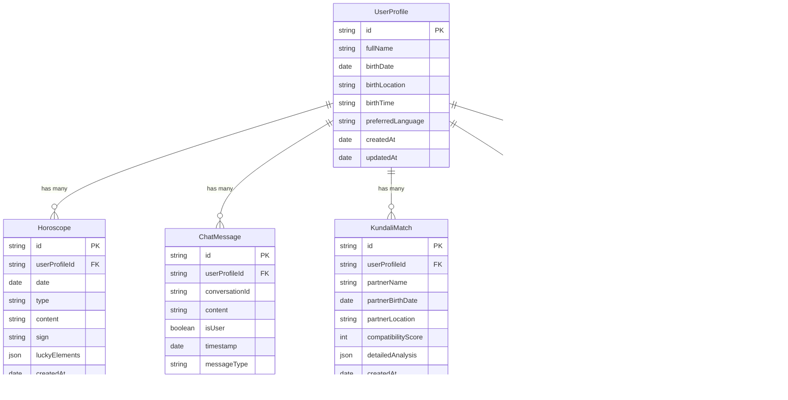

# 🌟 Astronova - AI-Powered Astrology iOS App

Astronova is a delightful astrology app that provides personalized cosmic insights, compatibility matching, and AI-powered guidance. Built with SwiftUI and CloudKit, it offers a beautiful, intuitive experience for exploring your cosmic journey.

## ✨ Features

- **60-Second Onboarding**: Streamlined 3-step profile setup with instant personalized insights
- **Daily Horoscopes**: Personalized daily guidance with cosmic themes and lucky elements
- **AI Astrologer Chat**: Intelligent conversation with Claude-powered astrological guidance
- **Compatibility Matching**: Check cosmic compatibility with friends, family, and partners
- **Birth Chart Visualization**: Interactive natal charts and planetary transit tracking
- **Guided First-Run Experience**: Beautiful animated tour across all app features
- **Cosmic Design System**: Modern UI with cosmic gradients, animations, and haptic feedback

## 🏗️ Architecture

### App Structure
```
astronova/
├── AstronovaApp/           # Main iOS app target
│   ├── AstronovaAppApp.swift    # App entry point
│   ├── AuthState.swift          # Authentication state management
│   ├── RootView.swift           # Main UI and all views
│   ├── LoadingView.swift        # Loading states
│   ├── OnboardingView.swift     # Initial onboarding
│   └── Assets.xcassets/         # App icons and assets
├── AstronovaAppTests/      # Unit tests
└── AstronovaAppUITests/    # UI tests
```

### Key Components

#### 1. Authentication Flow
- **Apple Sign-In Integration**: Seamless authentication with Apple ID
- **CloudKit Integration**: User data sync across devices
- **Keychain Storage**: Secure credential management
- **State Management**: Reactive authentication state with `@EnvironmentObject`

#### 2. Onboarding System
- **SimpleProfileSetupView**: 3-step cosmic onboarding (Welcome → Name → Birth Date)
- **Personalized Insights**: Instant cosmic reading based on birth date
- **Animated Backgrounds**: Cosmic gradients with floating stars
- **Confetti Celebrations**: Delightful completion animations

#### 3. Tab-Based Navigation
- **Today Tab**: Daily horoscopes with quick action CTAs
- **Match Tab**: Compatibility checking with simplified form
- **Chat Tab**: AI astrologer conversation interface
- **Profile Tab**: Birth charts, bookmarks, and settings

#### 4. Guided Experience System
- **TabGuideOverlay**: First-run tour across all tabs
- **Welcome Cards**: Contextual guidance for new users
- **CTA Integration**: Cross-tab navigation with haptic feedback
- **Usage Analytics**: Launch counting and onboarding state tracking

## 🗄️ CloudKit Data Model (ERD)



## 🔄 Application Flow Diagrams

### User Journey Flow


### First-Run Guide Flow

```mermaid
flowchart TD
    A[First App Launch] --> B[Track Launch Count]
    B --> C{Launch Count ≤ 2?}
    C -->|Yes| D[Show Tab Guide]
    C -->|No| E[Normal Experience]
    
    D --> F[Today Tab Guide]
    F --> G[Switch to Match Tab]
    G --> H[Match Tab Guide]
    H --> I[Switch to Chat Tab]
    I --> J[Chat Tab Guide]
    J --> K[Switch to Profile Tab]
    K --> L[Profile Tab Guide]
    L --> M[Complete Guide]
    M --> N[Set Guide Completed Flag]
    N --> E
    
    E --> O[Show Welcome Card?]
    O -->|Launch Count < 3| P[Display Welcome Card]
    O -->|Launch Count ≥ 3| Q[Standard Today View]
    
    P --> R[Quick Actions CTAs]
    R --> S[Discovery CTAs]
    Q --> S
```


## 🔌 API Endpoints & Integration

### Claude AI Chat Integration
```swift
// Chat Service API
struct ClaudeAPIService {
    func sendMessage(_ message: String) async throws -> String
    func generateHoroscope(for date: Date, sign: String) async throws -> String
    func generateCompatibilityReading(user: UserProfile, partner: PartnerData) async throws -> String
}
```

**Endpoint**: Anthropic Messages API v1
- **URL**: `https://api.anthropic.com/v1/messages`
- **Method**: `POST`
- **Headers**: 
  ```
  Content-Type: application/json
  x-api-key: [API_KEY]
  anthropic-version: 2023-06-01
  ```

**Input**:
```json
{
  "model": "claude-3-haiku-20240307",
  "max_tokens": 1024,
  "system": "You are a wise and insightful astrologer...",
  "messages": [
    {
      "role": "user", 
      "content": "What does my birth chart say about my career?"
    }
  ]
}
```

**Output**:
```json
{
  "id": "msg_123",
  "type": "message",
  "role": "assistant",
  "content": [
    {
      "type": "text",
      "text": "Based on your chart, you have strong leadership qualities..."
    }
  ]
}
```

### CloudKit Operations

#### User Profile Management
```swift
// Create/Update User Profile
func saveUserProfile(_ profile: UserProfile) async throws -> CKRecord

// Fetch User Profile  
func fetchUserProfile(for userID: String) async throws -> UserProfile?
```

**Input**: UserProfile object
```swift
UserProfile(
    fullName: "John Doe",
    birthDate: Date(),
    birthLocation: "New York, NY",
    preferredLanguage: "en"
)
```

**Output**: CKRecord with CloudKit metadata

#### Horoscope Data
```swift
// Fetch Daily Horoscope
func fetchHoroscope(for date: Date, userID: String) async throws -> Horoscope?

// Save Generated Horoscope
func saveHoroscope(_ horoscope: Horoscope) async throws -> CKRecord
```

#### Compatibility Matching
```swift
// Save Match Results
func saveMatch(_ match: KundaliMatch) async throws -> CKRecord

// Fetch User Matches
func fetchMatches(for userID: String) async throws -> [KundaliMatch]
```

### Astrology Calculation Engine

#### Birth Chart Generation
```swift
// Swiss Ephemeris Integration
func calculatePlanetPositions(date: Date, location: Location) -> [PlanetPosition]
func generateBirthChart(birthData: BirthData) -> BirthChart
```

**Input**:
```swift
BirthData(
    date: Date(),
    latitude: 40.7128,
    longitude: -74.0060,
    timezone: "America/New_York"
)
```

**Output**:
```swift
BirthChart(
    sunSign: "Sagittarius",
    moonSign: "Pisces", 
    risingSign: "Leo",
    planetPositions: [PlanetPosition],
    houses: [HousePosition],
    aspects: [AspectData]
)
```

#### Compatibility Analysis
```swift
// Match Calculation
func calculateCompatibility(user: BirthData, partner: BirthData) -> CompatibilityResult
```

**Input**: Two BirthData objects
**Output**:
```swift
CompatibilityResult(
    overallScore: 89,
    emotionalScore: 92,
    mentalScore: 88,
    physicalScore: 85,
    spiritualScore: 91,
    analysis: "Great cosmic connection...",
    strengths: ["Communication", "Shared Values"],
    challenges: ["Different Life Paces"]
)
```

## 🔐 Security & Privacy

- **End-to-End Encryption**: All user data encrypted in CloudKit
- **No Data Selling**: User privacy is paramount
- **Minimal Data Collection**: Only essential astrological data
- **Secure Authentication**: Apple Sign-In with CloudKit integration
- **Local Storage**: Sensitive calculations done on-device

## 🚀 Getting Started

### Prerequisites
- **Xcode** 15.0 or later
- **iOS** 18.0 or later deployment target
- **Apple Developer Account** (for CloudKit and testing)
- **Anthropic API Key** (for AI features)

### Setup
1. Clone the repository
2. Open `astronova.xcodeproj` in Xcode
3. Configure your Apple Developer team in project settings
4. Add your Anthropic API key to the app configuration
5. Build and run on simulator or device

### Configuration
```swift
// Add to your configuration
struct APIConfiguration {
    static let anthropicAPIKey = "your-api-key-here"
    static let cloudKitContainerID = "iCloud.com.yourteam.astronova"
}
```

## 🧪 Testing

```bash
# Run unit tests
xcodebuild test -project astronova.xcodeproj -scheme AstronovaApp -destination 'platform=iOS Simulator,name=iPhone 15'

# Run UI tests  
xcodebuild test -project astronova.xcodeproj -scheme AstronovaAppUITests -destination 'platform=iOS Simulator,name=iPhone 15'
```

## 📱 App Store Submission

The app is designed for App Store distribution with:
- **Privacy-first approach**: Compliant with App Store guidelines
- **In-App Purchases**: Premium features and readings
- **CloudKit integration**: Seamless data sync
- **Accessibility support**: VoiceOver and Dynamic Type
- **Localization ready**: Multi-language support framework

## 🎨 Design System

### Color Palette
- **Primary**: Cosmic Purple (#2d1b69)
- **Secondary**: Stellar Blue (#1a1a2e) 
- **Accent**: Golden (#FFD700)
- **Background**: Deep Space (#0f0f23)

### Typography
- **Primary Font**: SF Pro Rounded
- **Display**: System Large Title
- **Body**: System Body with increased line spacing

### Animation Principles
- **Spring Animations**: Natural, bouncy feel
- **Cosmic Themes**: Floating stars, gradient backgrounds
- **Haptic Feedback**: Medium impact for actions, light for navigation
- **Progressive Disclosure**: Smooth reveal animations

## 🤝 Contributing

1. Fork the repository
2. Create a feature branch (`git checkout -b feature/amazing-feature`)
3. Commit your changes (`git commit -m 'Add amazing feature'`)
4. Push to the branch (`git push origin feature/amazing-feature`)
5. Open a Pull Request

## 📄 License

This project is proprietary software. All rights reserved.

---

**Built with ❤️ and cosmic energy** ✨

*"The stars align for those who dare to look up"*