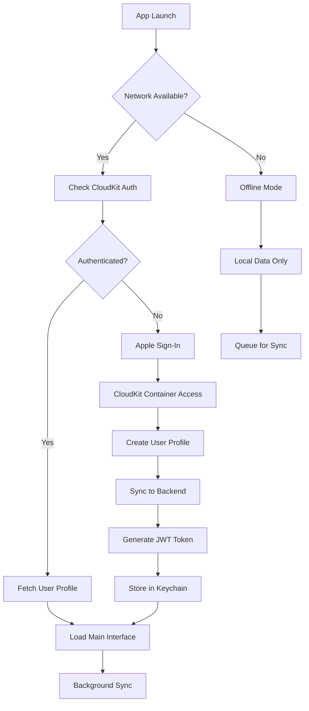

# 🧪 AstroNova System Testing & QA Strategy

## Overview
Comprehensive testing strategy for the AstroNova full-stack astrology application, covering iOS frontend, Python Flask backend, integrations, and end-to-end workflows.

## 🏗️ Testing Architecture

### Test Pyramid Structure
```
                    /\
                   /  \
              E2E Tests (5%)
                 /      \
                /        \
           Integration Tests (15%)
              /              \
             /                \
        Unit Tests (80%)
```

## 📱 iOS Frontend Testing

### Unit Tests (`AstronovaAppTests/`)

#### **Core Components Testing**
```swift
// Authentication State Tests
class AuthStateTests: XCTestCase {
    func testAppleSignInSuccess()
    func testAuthenticationStateManagement()
    func testCloudKitIntegration()
    func testKeyChainStorage()
}

// Onboarding Flow Tests  
class OnboardingTests: XCTestCase {
    func testProfileSetupValidation()
    func testBirthDateInput()
    func testPersonalizedInsightGeneration()
    func testOnboardingCompletion()
}

// Tab Navigation Tests
class NavigationTests: XCTestCase {
    func testTabSwitching()
    func testGuidedExperienceFlow()
    func testDeepLinkingSupport()
}
```

#### **Data Model Tests**
```swift
class UserProfileTests: XCTestCase {
    func testUserProfileCreation()
    func testCloudKitSerialization()
    func testDataValidation()
}

class HoroscopeTests: XCTestCase {
    func testHoroscopeDataModel()
    func testLuckyElementsParsing()
    func testDateHandling()
}
```

#### **API Integration Tests**
```swift
class APIServiceTests: XCTestCase {
    func testBackendConnectivity()
    func testAuthenticationHeaders()
    func testErrorHandling()
    func testNetworkTimeout()
}
```

### UI Tests (`AstronovaAppUITests/`)

#### **User Journey Testing**
```swift
class OnboardingUITests: XCTestCase {
    func testCompleteOnboardingFlow()
    func testAppleSignInButton()
    func testNameInputValidation()
    func testBirthDatePicker()
    func testPersonalizedReadingDisplay()
}

class MainAppUITests: XCTestCase {
    func testTabNavigation()
    func testTodayTabFunctionality()
    func testMatchTabCompatibility()
    func testChatInterface()
    func testProfileTabAccess()
}

class AccessibilityTests: XCTestCase {
    func testVoiceOverSupport()
    func testDynamicTypeSupport()
    func testHighContrastMode()
    func testReducedMotionSupport()
}
```

#### **Visual Testing**
```swift
class SnapshotTests: XCTestCase {
    func testOnboardingScreenshots()
    func testTabScreenshots()
    func testDarkModeSupport()
    func testVariousScreenSizes()
}
```

## 🐍 Backend Testing (`backend/tests/`)

### Unit Tests

#### **API Endpoints Testing**
```python
# tests/test_endpoints.py
class TestChatEndpoints:
    def test_chat_message_valid_input(self)
    def test_chat_message_invalid_input(self)
    def test_chat_history_retrieval(self)
    def test_rate_limiting(self)

class TestHoroscopeEndpoints:
    def test_daily_horoscope_generation(self)
    def test_personalized_horoscope(self)
    def test_invalid_zodiac_sign(self)

class TestMatchEndpoints:
    def test_compatibility_calculation(self)
    def test_match_history(self)
    def test_invalid_birth_data(self)

class TestChartEndpoints:
    def test_birth_chart_generation(self)
    def test_planetary_transits(self)
    def test_invalid_coordinates(self)
```

#### **Service Layer Testing**
```python
# tests/test_services.py
class TestAstroCalculator:
    def test_planet_position_calculation(self)
    def test_house_calculation(self)
    def test_aspect_analysis(self)
    def test_zodiac_sign_determination(self)

class TestClaudeAI:
    def test_ai_message_generation(self)
    def test_horoscope_generation(self)
    def test_api_key_validation(self)
    def test_rate_limit_handling(self)

class TestEphemerisService:
    def test_current_planetary_positions(self)
    def test_historical_data_retrieval(self)
    def test_timezone_conversion(self)
```

#### **Data Model Testing**
```python
# tests/test_models.py
class TestSchemas:
    def test_user_profile_validation(self)
    def test_birth_data_validation(self)
    def test_chat_message_validation(self)
    def test_compatibility_result_serialization(self)
```

### Integration Tests

#### **External API Testing**
```python
class TestAnthropicIntegration:
    def test_claude_api_connectivity(self)
    def test_api_key_authentication(self)
    def test_response_format_validation(self)

class TestRedisIntegration:
    def test_cache_operations(self)
    def test_session_management(self)
    def test_rate_limit_storage(self)
```

#### **Database Integration**
```python
class TestCloudKitIntegration:
    def test_user_profile_sync(self)
    def test_horoscope_storage(self)
    def test_match_history_persistence(self)
```

## 🔄 End-to-End Testing

### Full System Integration Tests

#### **Swift CloudKit ↔ Backend Integration Testing**

##### **Data Synchronization Test Suite**
```swift
// Tests/Integration/CloudKitBackendIntegrationTests.swift
class CloudKitBackendIntegrationTests: XCTestCase {
    var cloudKitService: CloudKitService!
    var backendAPI: AstronovaAPIService!
    var testUserProfile: UserProfile!
    
    override func setUp() {
        super.setUp()
        cloudKitService = CloudKitService.shared
        backendAPI = AstronovaAPIService()
        testUserProfile = createTestUserProfile()
    }
    
    func testUserProfileSyncFlow() async throws {
        // 1. Create user profile in CloudKit
        let cloudKitRecord = try await cloudKitService.saveUserProfile(testUserProfile)
        XCTAssertNotNil(cloudKitRecord.recordID)
        
        // 2. Sync profile to backend via API
        let backendProfile = try await backendAPI.syncUserProfile(testUserProfile)
        XCTAssertEqual(backendProfile.id, cloudKitRecord.recordID.recordName)
        
        // 3. Update profile in backend
        let updatedProfile = testUserProfile
        updatedProfile.preferredLanguage = "es"
        try await backendAPI.updateUserProfile(updatedProfile)
        
        // 4. Verify CloudKit receives update
        let syncedProfile = try await cloudKitService.fetchUserProfile(testUserProfile.id)
        XCTAssertEqual(syncedProfile?.preferredLanguage, "es")
    }
    
    func testHoroscopeGenerationAndSync() async throws {
        // 1. Generate horoscope via backend API
        let horoscopeRequest = HoroscopeRequest(
            userID: testUserProfile.id,
            date: Date(),
            type: .daily
        )
        let generatedHoroscope = try await backendAPI.generateHoroscope(horoscopeRequest)
        XCTAssertNotNil(generatedHoroscope.content)
        
        // 2. Save to CloudKit
        let cloudKitRecord = try await cloudKitService.saveHoroscope(generatedHoroscope)
        XCTAssertNotNil(cloudKitRecord.recordID)
        
        // 3. Verify data consistency
        let fetchedHoroscope = try await cloudKitService.fetchHoroscope(generatedHoroscope.id)
        XCTAssertEqual(fetchedHoroscope?.content, generatedHoroscope.content)
        XCTAssertEqual(fetchedHoroscope?.userProfileId, testUserProfile.id)
    }
    
    func testChatMessageRealTimeSync() async throws {
        // 1. Send message via backend API
        let chatMessage = ChatMessage(
            userProfileId: testUserProfile.id,
            content: "What does my birth chart say about career?",
            isUser: true,
            timestamp: Date()
        )
        
        let aiResponse = try await backendAPI.sendChatMessage(chatMessage)
        XCTAssertFalse(aiResponse.isUser)
        XCTAssertNotNil(aiResponse.content)
        
        // 2. Save both messages to CloudKit
        try await cloudKitService.saveChatMessage(chatMessage)
        try await cloudKitService.saveChatMessage(aiResponse)
        
        // 3. Verify conversation persistence
        let conversation = try await cloudKitService.fetchChatHistory(testUserProfile.id)
        XCTAssertEqual(conversation.count, 2)
        XCTAssertTrue(conversation.contains { $0.isUser })
        XCTAssertTrue(conversation.contains { !$0.isUser })
    }
    
    func testCompatibilityMatchWithBackendCalculation() async throws {
        // 1. Create partner data
        let partnerData = PartnerData(
            name: "Test Partner",
            birthDate: Date().addingTimeInterval(-86400 * 365 * 25), // 25 years ago
            birthLocation: "Los Angeles, CA"
        )
        
        // 2. Calculate compatibility via backend
        let compatibilityResult = try await backendAPI.calculateCompatibility(
            user: testUserProfile.birthData,
            partner: partnerData.birthData
        )
        XCTAssertGreaterThan(compatibilityResult.overallScore, 0)
        XCTAssertLessThanOrEqual(compatibilityResult.overallScore, 100)
        
        // 3. Save match to CloudKit
        let match = KundaliMatch(
            userProfileId: testUserProfile.id,
            partnerName: partnerData.name,
            partnerBirthDate: partnerData.birthDate,
            partnerLocation: partnerData.birthLocation,
            compatibilityScore: compatibilityResult.overallScore,
            detailedAnalysis: compatibilityResult.analysis
        )
        
        let savedMatch = try await cloudKitService.saveMatch(match)
        XCTAssertNotNil(savedMatch.recordID)
        
        // 4. Verify match retrieval
        let fetchedMatches = try await cloudKitService.fetchMatches(testUserProfile.id)
        XCTAssertGreaterThan(fetchedMatches.count, 0)
        XCTAssertEqual(fetchedMatches.first?.compatibilityScore, compatibilityResult.overallScore)
    }
}
```

##### **Offline/Online Sync Testing**
```swift
class OfflineOnlineSyncTests: XCTestCase {
    func testOfflineDataPersistence() async throws {
        // 1. Simulate offline mode
        NetworkMonitor.shared.forceOfflineMode()
        
        // 2. Create data while offline
        let offlineHoroscope = Horoscope(
            userProfileId: testUserProfile.id,
            date: Date(),
            content: "Offline generated content",
            sign: "Gemini"
        )
        
        // 3. Save to local Core Data
        try await LocalDataService.shared.saveHoroscope(offlineHoroscope)
        
        // 4. Verify local storage
        let localHoroscopes = try await LocalDataService.shared.fetchHoroscopes(testUserProfile.id)
        XCTAssertEqual(localHoroscopes.count, 1)
        
        // 5. Simulate going back online
        NetworkMonitor.shared.enableOnlineMode()
        
        // 6. Trigger sync
        try await SyncManager.shared.syncPendingData()
        
        // 7. Verify CloudKit has the data
        let cloudKitHoroscopes = try await cloudKitService.fetchHoroscopes(testUserProfile.id)
        XCTAssertGreaterThan(cloudKitHoroscopes.count, 0)
        XCTAssertTrue(cloudKitHoroscopes.contains { $0.content == "Offline generated content" })
    }
    
    func testConflictResolution() async throws {
        // 1. Create same record in both local and CloudKit with different data
        let localProfile = testUserProfile
        localProfile.preferredLanguage = "es"
        try await LocalDataService.shared.saveUserProfile(localProfile)
        
        let cloudProfile = testUserProfile
        cloudProfile.preferredLanguage = "fr"
        try await cloudKitService.saveUserProfile(cloudProfile)
        
        // 2. Trigger sync with conflict resolution
        try await SyncManager.shared.resolveConflicts()
        
        // 3. Verify conflict resolution strategy (latest timestamp wins)
        let resolvedProfile = try await cloudKitService.fetchUserProfile(testUserProfile.id)
        XCTAssertNotNil(resolvedProfile)
        // Verify resolution logic based on your conflict resolution strategy
    }
}
```

#### **Complete User Journey Tests**
```bash
# Test Script: comprehensive_e2e_test.sh
#!/bin/bash

set -e

echo "🚀 Starting Comprehensive E2E Testing"

# Environment setup
export BACKEND_URL="http://localhost:8080"
export TEST_ENVIRONMENT="integration"
export CLOUDKIT_CONTAINER="iCloud.com.sankalp.AstronovaApp.test"

# 1. Start backend server with test configuration
echo "📡 Starting backend server..."
cd backend
python -m pytest tests/test_endpoints.py --tb=short # Verify backend health first
python app.py --test-mode &
BACKEND_PID=$!
sleep 5

# Wait for backend to be ready
echo "⏳ Waiting for backend to be ready..."
timeout 30s bash -c 'until curl -f http://localhost:8080/api/v1/misc/health; do sleep 1; done'

# 2. Start Redis for caching
echo "🗄️ Starting Redis..."
redis-server --port 6380 --daemonize yes --logfile redis-test.log

# 3. Set up iOS simulator
echo "📱 Setting up iOS simulator..."
SIMULATOR_ID=$(xcrun simctl create "TestDevice" "iPhone 15" "iOS-18-0")
xcrun simctl boot $SIMULATOR_ID
xcrun simctl keychain $SIMULATOR_ID reset # Reset keychain for clean state

# 4. Build iOS app with test configuration
echo "🔨 Building iOS app..."
xcodebuild clean build-for-testing \
    -project astronova.xcodeproj \
    -scheme AstronovaApp \
    -destination "id=$SIMULATOR_ID" \
    -configuration Debug \
    -derivedDataPath build/

# 5. Run comprehensive integration tests
echo "🧪 Running integration tests..."

# Backend API tests
cd backend
python -m pytest tests/test_integration.py -v --tb=short
cd ..

# iOS CloudKit integration tests  
xcodebuild test \
    -project astronova.xcodeproj \
    -scheme AstronovaApp \
    -destination "id=$SIMULATOR_ID" \
    -only-testing:AstronovaAppTests/CloudKitIntegrationTests

# iOS-Backend integration tests
xcodebuild test \
    -project astronova.xcodeproj \
    -scheme AstronovaApp \
    -destination "id=$SIMULATOR_ID" \
    -only-testing:AstronovaAppTests/BackendIntegrationTests

# Full UI workflow tests
xcodebuild test \
    -project astronova.xcodeproj \
    -scheme AstronovaAppUITests \
    -destination "id=$SIMULATOR_ID" \
    -only-testing:AstronovaAppUITests/FullWorkflowTests

# 6. Test specific critical paths
echo "🎯 Testing critical user journeys..."

# Authentication and onboarding flow
xcodebuild test \
    -project astronova.xcodeproj \
    -scheme AstronovaAppUITests \
    -destination "id=$SIMULATOR_ID" \
    -only-testing:AstronovaAppUITests/AuthenticationFlowTests

# Data sync and persistence
xcodebuild test \
    -project astronova.xcodeproj \
    -scheme AstronovaApp \
    -destination "id=$SIMULATOR_ID" \
    -only-testing:AstronovaAppTests/DataSyncTests

# AI chat functionality
xcodebuild test \
    -project astronova.xcodeproj \
    -scheme AstronovaAppUITests \
    -destination "id=$SIMULATOR_ID" \
    -only-testing:AstronovaAppUITests/AIChatTests

# 7. Performance and load testing
echo "⚡ Running performance tests..."
cd backend
python -m pytest tests/test_performance.py -v
cd ..

# iOS performance tests
xcodebuild test \
    -project astronova.xcodeproj \
    -scheme AstronovaApp \
    -destination "id=$SIMULATOR_ID" \
    -only-testing:AstronovaAppTests/PerformanceTests

# 8. Cleanup
echo "🧹 Cleaning up..."
kill $BACKEND_PID
redis-cli -p 6380 shutdown
xcrun simctl delete $SIMULATOR_ID

echo "✅ Comprehensive E2E Testing Complete"
```

#### **Critical Path Testing Matrix**

##### **Authentication & Authorization Flow**


##### **Data Flow Integration Testing**
```swift
// Comprehensive data flow test
class DataFlowIntegrationTests: XCTestCase {
    func testCompleteDataFlow() async throws {
        // 1. User Authentication
        let authResult = try await AuthenticationManager.shared.signInWithApple()
        XCTAssertTrue(authResult.isAuthenticated)
        
        // 2. CloudKit Setup
        let cloudKitAccess = try await CloudKitService.shared.requestAccess()
        XCTAssertTrue(cloudKitAccess)
        
        // 3. User Profile Creation
        let userProfile = UserProfile(
            fullName: "Integration Test User",
            birthDate: Date().addingTimeInterval(-86400 * 365 * 30), // 30 years ago
            birthLocation: "New York, NY"
        )
        
        // 4. Save to CloudKit
        let cloudKitRecord = try await CloudKitService.shared.saveUserProfile(userProfile)
        XCTAssertNotNil(cloudKitRecord.recordID)
        
        // 5. Sync to Backend
        let jwtToken = try await BackendAuthService.shared.authenticateUser(userProfile.id)
        XCTAssertNotNil(jwtToken)
        
        let syncResult = try await BackendSyncService.shared.syncUserProfile(userProfile, token: jwtToken)
        XCTAssertTrue(syncResult.success)
        
        // 6. Generate Horoscope via Backend
        let horoscopeRequest = HoroscopeRequest(
            userID: userProfile.id,
            date: Date(),
            type: .personalized
        )
        
        let horoscope = try await AstronovaAPIService.shared.generateHoroscope(horoscopeRequest, token: jwtToken)
        XCTAssertNotNil(horoscope.content)
        XCTAssertGreaterThan(horoscope.content.count, 50)
        
        // 7. Save Horoscope to CloudKit
        let horoscopeRecord = try await CloudKitService.shared.saveHoroscope(horoscope)
        XCTAssertNotNil(horoscopeRecord.recordID)
        
        // 8. Verify Cross-Platform Sync
        let fetchedFromCloudKit = try await CloudKitService.shared.fetchHoroscope(horoscope.id)
        let fetchedFromBackend = try await AstronovaAPIService.shared.getHoroscope(horoscope.id, token: jwtToken)
        
        XCTAssertEqual(fetchedFromCloudKit?.content, fetchedFromBackend?.content)
        
        // 9. Test Offline Capability
        NetworkSimulator.shared.enableOfflineMode()
        
        let offlineHoroscope = try await LocalDataService.shared.fetchHoroscope(horoscope.id)
        XCTAssertNotNil(offlineHoroscope)
        XCTAssertEqual(offlineHoroscope?.content, horoscope.content)
        
        // 10. Test Sync on Reconnection
        NetworkSimulator.shared.enableOnlineMode()
        try await SyncManager.shared.performFullSync()
        
        // Verify no data loss and consistency maintained
        let finalCloudKitData = try await CloudKitService.shared.fetchAllUserData(userProfile.id)
        let finalBackendData = try await AstronovaAPIService.shared.getAllUserData(userProfile.id, token: jwtToken)
        
        XCTAssertEqual(finalCloudKitData.horoscopes.count, finalBackendData.horoscopes.count)
    }
}
```

##### **Backend Integration Test Suite**
```python
# backend/tests/test_full_integration.py
import pytest
import asyncio
import json
from unittest.mock import patch, MagicMock

class TestFullSystemIntegration:
    """Comprehensive backend integration tests with CloudKit simulation"""
    
    @pytest.fixture
    def mock_cloudkit_service(self):
        """Mock CloudKit service for backend testing"""
        with patch('services.cloudkit_service.CloudKitService') as mock:
            mock_instance = MagicMock()
            mock.return_value = mock_instance
            yield mock_instance
    
    @pytest.fixture
    def test_user_data(self):
        return {
            "id": "test-user-123",
            "fullName": "Integration Test User",
            "birthDate": "1990-05-15T10:30:00Z",
            "birthLocation": "New York, NY",
            "timezone": "America/New_York"
        }
    
    async def test_user_profile_sync_workflow(self, client, mock_cloudkit_service, test_user_data):
        """Test complete user profile synchronization between backend and CloudKit"""
        
        # 1. Simulate CloudKit user profile creation
        mock_cloudkit_service.save_user_profile.return_value = {
            "recordID": "CK_RECORD_123",
            "success": True
        }
        
        # 2. Sync profile to backend
        response = await client.post('/api/v1/users/sync', json=test_user_data)
        assert response.status_code == 201
        
        backend_user = response.json()
        assert backend_user['id'] == test_user_data['id']
        assert backend_user['fullName'] == test_user_data['fullName']
        
        # 3. Verify CloudKit sync was called
        mock_cloudkit_service.save_user_profile.assert_called_once()
        
        # 4. Test profile update propagation
        updated_data = test_user_data.copy()
        updated_data['preferredLanguage'] = 'es'
        
        response = await client.put(f'/api/v1/users/{test_user_data["id"]}', json=updated_data)
        assert response.status_code == 200
        
        # 5. Verify CloudKit update notification
        mock_cloudkit_service.update_user_profile.assert_called_once()
    
    async def test_horoscope_generation_and_storage(self, client, mock_cloudkit_service, test_user_data):
        """Test horoscope generation, backend storage, and CloudKit sync"""
        
        # 1. Create user first
        await client.post('/api/v1/users/sync', json=test_user_data)
        
        # 2. Generate personalized horoscope
        horoscope_request = {
            "userID": test_user_data['id'],
            "date": "2024-01-15",
            "type": "personalized",
            "birthData": {
                "date": test_user_data['birthDate'],
                "location": test_user_data['birthLocation']
            }
        }
        
        with patch('services.claude_ai.ClaudeAI.generate_horoscope') as mock_ai:
            mock_ai.return_value = {
                "content": "Today brings powerful cosmic alignments for your career...",
                "confidence": 0.92,
                "sources": ["natal_chart", "daily_transits"]
            }
            
            response = await client.post('/api/v1/horoscope/custom', json=horoscope_request)
            assert response.status_code == 201
            
            horoscope = response.json()
            assert 'content' in horoscope
            assert len(horoscope['content']) > 50
            assert horoscope['userID'] == test_user_data['id']
        
        # 3. Verify CloudKit storage
        mock_cloudkit_service.save_horoscope.assert_called_once()
        
        # 4. Test horoscope retrieval
        response = await client.get(f'/api/v1/horoscope/{horoscope["id"]}')
        assert response.status_code == 200
        
        retrieved_horoscope = response.json()
        assert retrieved_horoscope['content'] == horoscope['content']
    
    async def test_ai_chat_integration_workflow(self, client, mock_cloudkit_service, test_user_data):
        """Test AI chat functionality with CloudKit message persistence"""
        
        # 1. Setup user
        await client.post('/api/v1/users/sync', json=test_user_data)
        
        # 2. Send chat message
        chat_request = {
            "userID": test_user_data['id'],
            "message": "What does my birth chart say about relationships?",
            "context": {
                "birthDate": test_user_data['birthDate'],
                "birthLocation": test_user_data['birthLocation']
            }
        }
        
        with patch('services.claude_ai.ClaudeAI.chat') as mock_chat:
            mock_chat.return_value = {
                "response": "Based on your birth chart, you have Venus in the 7th house...",
                "confidence": 0.89,
                "conversation_id": "conv_123"
            }
            
            response = await client.post('/api/v1/chat', json=chat_request)
            assert response.status_code == 200
            
            chat_response = response.json()
            assert 'response' in chat_response
            assert 'conversation_id' in chat_response
        
        # 3. Verify chat history storage
        response = await client.get(f'/api/v1/chat/history/{test_user_data["id"]}')
        assert response.status_code == 200
        
        history = response.json()
        assert len(history['messages']) >= 2  # User message + AI response
        
        # 4. Verify CloudKit sync for chat messages
        assert mock_cloudkit_service.save_chat_message.call_count >= 2
    
    async def test_compatibility_calculation_workflow(self, client, mock_cloudkit_service, test_user_data):
        """Test compatibility calculation and match storage"""
        
        # 1. Setup user
        await client.post('/api/v1/users/sync', json=test_user_data)
        
        # 2. Calculate compatibility
        compatibility_request = {
            "userID": test_user_data['id'],
            "user_birth_data": {
                "date": test_user_data['birthDate'],
                "location": test_user_data['birthLocation']
            },
            "partner_birth_data": {
                "name": "Test Partner",
                "date": "1992-08-20T14:15:00Z",
                "location": "Los Angeles, CA"
            }
        }
        
        with patch('services.astro_calculator.AstroCalculator.calculate_compatibility') as mock_calc:
            mock_calc.return_value = {
                "overall_score": 87,
                "emotional_score": 92,
                "mental_score": 84,
                "physical_score": 89,
                "spiritual_score": 82,
                "analysis": {
                    "strengths": ["Strong emotional connection", "Complementary communication styles"],
                    "challenges": ["Different approaches to spirituality"],
                    "advice": "Focus on your shared emotional intelligence..."
                }
            }
            
            response = await client.post('/api/v1/match/compatibility', json=compatibility_request)
            assert response.status_code == 201
            
            match_result = response.json()
            assert match_result['overall_score'] == 87
            assert 'analysis' in match_result
        
        # 3. Verify match storage in CloudKit
        mock_cloudkit_service.save_match.assert_called_once()
        
        # 4. Test match history retrieval
        response = await client.get(f'/api/v1/match/history/{test_user_data["id"]}')
        assert response.status_code == 200
        
        matches = response.json()
        assert len(matches) >= 1
        assert matches[0]['overall_score'] == 87
    
    async def test_birth_chart_generation_integration(self, client, mock_cloudkit_service, test_user_data):
        """Test birth chart generation with Swiss Ephemeris integration"""
        
        # 1. Setup user
        await client.post('/api/v1/users/sync', json=test_user_data)
        
        # 2. Generate birth chart
        chart_request = {
            "userID": test_user_data['id'],
            "birth_data": {
                "date": test_user_data['birthDate'],
                "location": test_user_data['birthLocation'],
                "timezone": test_user_data['timezone']
            }
        }
        
        with patch('services.ephemeris_service.EphemerisService.calculate_positions') as mock_ephemeris:
            mock_ephemeris.return_value = {
                "sun": {"sign": "Taurus", "degree": 24.5, "house": 7},
                "moon": {"sign": "Pisces", "degree": 12.3, "house": 5},
                "mercury": {"sign": "Aries", "degree": 8.7, "house": 6},
                "venus": {"sign": "Gemini", "degree": 16.2, "house": 8},
                "mars": {"sign": "Leo", "degree": 3.1, "house": 10}
            }
            
            response = await client.post('/api/v1/chart/generate', json=chart_request)
            assert response.status_code == 201
            
            chart = response.json()
            assert 'chart_id' in chart
            assert 'planetary_positions' in chart
            assert chart['planetary_positions']['sun']['sign'] == 'Taurus'
        
        # 3. Verify chart storage
        mock_cloudkit_service.save_birth_chart.assert_called_once()
        
        # 4. Test chart retrieval
        chart_id = chart['chart_id']
        response = await client.get(f'/api/v1/chart/{chart_id}')
        assert response.status_code == 200
        
        retrieved_chart = response.json()
        assert retrieved_chart['planetary_positions']['sun']['sign'] == 'Taurus'
    
    async def test_error_handling_and_resilience(self, client, mock_cloudkit_service, test_user_data):
        """Test system resilience and error handling across integrations"""
        
        # 1. Test CloudKit failure handling
        mock_cloudkit_service.save_user_profile.side_effect = Exception("CloudKit unavailable")
        
        response = await client.post('/api/v1/users/sync', json=test_user_data)
        # Should still succeed but queue for retry
        assert response.status_code in [201, 202]  # Created or Accepted for async processing
        
        # 2. Test AI service failure
        with patch('services.claude_ai.ClaudeAI.generate_horoscope') as mock_ai:
            mock_ai.side_effect = Exception("AI service timeout")
            
            horoscope_request = {
                "userID": test_user_data['id'],
                "date": "2024-01-15",
                "type": "daily"
            }
            
            response = await client.post('/api/v1/horoscope/custom', json=horoscope_request)
            assert response.status_code == 503  # Service unavailable
            
            error_response = response.json()
            assert 'error' in error_response
            assert 'retry_after' in error_response
        
        # 3. Test rate limiting enforcement
        for i in range(55):  # Exceed hourly limit of 50
            response = await client.get('/api/v1/misc/health')
            if i < 50:
                assert response.status_code == 200
            else:
                assert response.status_code == 429  # Too many requests
    
    async def test_data_consistency_across_services(self, client, mock_cloudkit_service, test_user_data):
        """Test data consistency between backend and CloudKit"""
        
        # 1. Create user profile
        await client.post('/api/v1/users/sync', json=test_user_data)
        
        # 2. Generate multiple data types
        horoscope_request = {
            "userID": test_user_data['id'],
            "date": "2024-01-15",
            "type": "daily"
        }
        
        with patch('services.claude_ai.ClaudeAI.generate_horoscope') as mock_ai:
            mock_ai.return_value = {"content": "Test horoscope", "confidence": 0.9}
            await client.post('/api/v1/horoscope/custom', json=horoscope_request)
        
        # 3. Verify all CloudKit save operations maintain referential integrity
        saved_calls = mock_cloudkit_service.save_user_profile.call_args_list + \
                     mock_cloudkit_service.save_horoscope.call_args_list
        
        # Verify user ID consistency across all records
        for call in saved_calls:
            record_data = call[0][0]  # First argument of the call
            assert test_user_data['id'] in str(record_data)
        
        # 4. Test transaction rollback on partial failure
        mock_cloudkit_service.save_horoscope.side_effect = Exception("CloudKit write failed")
        
        with pytest.raises(Exception):
            await client.post('/api/v1/horoscope/custom', json=horoscope_request)
        
        # Verify no orphaned records in backend
        response = await client.get(f'/api/v1/horoscope/user/{test_user_data["id"]}')
        horoscopes = response.json()
        # Should not contain the failed horoscope
        assert len([h for h in horoscopes if h['date'] == '2024-01-15']) == 1  # Only the successful one

class TestRealtimeSync:
    """Test real-time synchronization between iOS and backend"""
    
    async def test_websocket_notifications(self, client, test_user_data):
        """Test WebSocket notifications for real-time updates"""
        
        # 1. Establish WebSocket connection (simulated)
        with patch('websockets.connect') as mock_ws:
            mock_connection = MagicMock()
            mock_ws.return_value = mock_connection
            
            # 2. Generate horoscope that should trigger notification
            horoscope_request = {
                "userID": test_user_data['id'],
                "date": "2024-01-15",
                "type": "daily"
            }
            
            with patch('services.claude_ai.ClaudeAI.generate_horoscope') as mock_ai:
                mock_ai.return_value = {"content": "New horoscope", "confidence": 0.9}
                
                response = await client.post('/api/v1/horoscope/custom', json=horoscope_request)
                assert response.status_code == 201
            
            # 3. Verify WebSocket notification was sent
            mock_connection.send.assert_called_once()
            
            # Parse notification payload
            notification_data = json.loads(mock_connection.send.call_args[0][0])
            assert notification_data['type'] == 'horoscope_generated'
            assert notification_data['userID'] == test_user_data['id']
    
    async def test_push_notification_integration(self, client, test_user_data):
        """Test APNs push notification integration"""
        
        with patch('services.push_notification_service.APNsService.send_notification') as mock_apns:
            # Generate daily horoscope
            horoscope_request = {
                "userID": test_user_data['id'],
                "date": "2024-01-15",
                "type": "daily"
            }
            
            with patch('services.claude_ai.ClaudeAI.generate_horoscope') as mock_ai:
                mock_ai.return_value = {"content": "Your daily cosmic guidance", "confidence": 0.9}
                
                response = await client.post('/api/v1/horoscope/custom', json=horoscope_request)
                assert response.status_code == 201
            
            # Verify push notification was sent
            mock_apns.assert_called_once()
            
            # Verify notification payload
            call_args = mock_apns.call_args
            assert call_args[1]['user_id'] == test_user_data['id']
            assert 'cosmic guidance' in call_args[1]['message']
```

##### **Cross-Platform Data Validation**
```python
# backend/tests/test_cross_platform_validation.py
class TestCrossPlatformDataValidation:
    """Validate data consistency between iOS CloudKit and Backend"""
    
    @pytest.fixture
    def cloudkit_user_schema(self):
        """Expected CloudKit UserProfile schema"""
        return {
            "recordType": "UserProfile",
            "fields": {
                "fullName": {"value": str},
                "birthDate": {"value": "datetime"},
                "birthLocation": {"value": str},
                "preferredLanguage": {"value": str},
                "createdAt": {"value": "datetime"},
                "updatedAt": {"value": "datetime"}
            }
        }
    
    def test_user_profile_schema_compatibility(self, cloudkit_user_schema):
        """Ensure backend UserProfile matches CloudKit schema"""
        from models.schemas import UserProfileSchema
        
        backend_schema = UserProfileSchema()
        cloudkit_fields = set(cloudkit_user_schema["fields"].keys())
        backend_fields = set(backend_schema.fields.keys())
        
        # Verify all CloudKit fields are supported in backend
        missing_fields = cloudkit_fields - backend_fields
        assert not missing_fields, f"Backend missing CloudKit fields: {missing_fields}"
        
        # Verify critical fields match
        for field in ["fullName", "birthDate", "birthLocation"]:
            assert field in backend_fields, f"Critical field {field} missing from backend"
    
    def test_data_type_consistency(self):
        """Test data type consistency between platforms"""
        from datetime import datetime
        import json
        
        # Test date serialization consistency
        test_date = datetime(1990, 5, 15, 10, 30, 0)
        
        # iOS expects ISO 8601 format
        ios_format = test_date.isoformat() + "Z"
        backend_format = test_date.strftime("%Y-%m-%dT%H:%M:%SZ")
        
        assert ios_format == backend_format or ios_format.replace("Z", "+00:00") == backend_format
    
    async def test_json_serialization_compatibility(self, client):
        """Test JSON serialization between iOS and backend"""
        
        # Create test data that matches iOS expectations
        test_data = {
            "fullName": "Test User",
            "birthDate": "1990-05-15T10:30:00Z",
            "birthLocation": "New York, NY",
            "preferredLanguage": "en"
        }
        
        # Send to backend
        response = await client.post('/api/v1/users/sync', json=test_data)
        assert response.status_code == 201
        
        # Verify response format matches iOS expectations
        response_data = response.json()
        
        # Check all required fields are present
        required_fields = ["id", "fullName", "birthDate", "birthLocation", "createdAt"]
        for field in required_fields:
            assert field in response_data, f"Required field {field} missing from response"
        
        # Verify date format is iOS-compatible
        import datetime
        birth_date = datetime.datetime.fromisoformat(response_data["birthDate"].replace("Z", "+00:00"))
        assert isinstance(birth_date, datetime.datetime)
```

### Performance Testing

#### **Load Testing**
```python
# tests/test_performance.py
import asyncio
import aiohttp

class TestBackendPerformance:
    async def test_concurrent_requests(self):
        """Test 100 concurrent API requests"""
        
    async def test_rate_limiting_enforcement(self):
        """Test rate limit behavior under load"""
        
    def test_response_times(self):
        """Ensure API responses under 2 seconds"""
        
    def test_memory_usage(self):
        """Monitor backend memory consumption"""
```

#### **iOS Performance Testing**
```swift
class PerformanceTests: XCTestCase {
    func testAppLaunchTime() {
        measure {
            // App launch performance
        }
    }
    
    func testMemoryUsage() {
        // Monitor memory consumption
    }
    
    func testBatteryUsage() {
        // Test energy efficiency
    }
}
```

## 🚨 Test Automation & CI/CD

### GitHub Actions Workflow

#### **Backend Testing Pipeline**
```yaml
# .github/workflows/backend-tests.yml
name: Backend Tests
on: [push, pull_request]

jobs:
  test:
    runs-on: ubuntu-latest
    
    services:
      redis:
        image: redis:alpine
        ports:
          - 6379:6379
    
    steps:
      - uses: actions/checkout@v3
      - uses: actions/setup-python@v4
        with:
          python-version: '3.11'
      
      - name: Install dependencies
        run: |
          cd backend
          pip install -r requirements.txt
          pip install pytest pytest-cov
      
      - name: Run tests
        run: |
          cd backend
          pytest --cov=. --cov-report=xml
      
      - name: Upload coverage
        uses: codecov/codecov-action@v3
```

#### **iOS Testing Pipeline**
```yaml
# .github/workflows/ios-tests.yml  
name: iOS Tests
on: [push, pull_request]

jobs:
  test:
    runs-on: macos-latest
    
    steps:
      - uses: actions/checkout@v3
      
      - name: Select Xcode version
        run: sudo xcode-select -s /Applications/Xcode_15.0.app
      
      - name: Run unit tests
        run: |
          xcodebuild test \
            -project astronova.xcodeproj \
            -scheme AstronovaApp \
            -destination 'platform=iOS Simulator,name=iPhone 15'
      
      - name: Run UI tests
        run: |
          xcodebuild test \
            -project astronova.xcodeproj \
            -scheme AstronovaAppUITests \
            -destination 'platform=iOS Simulator,name=iPhone 15'
```

### Test Data Management

#### **Test Data Setup**
```python
# tests/conftest.py
@pytest.fixture
def test_user_profile():
    return {
        "fullName": "Test User",
        "birthDate": "1990-05-15T10:30:00Z",
        "birthLocation": "New York, NY",
        "timezone": "America/New_York"
    }

@pytest.fixture
def mock_claude_response():
    return {
        "response": "Test astrological insight",
        "confidence": 0.95,
        "sources": ["natal_chart"]
    }
```

#### **Test Environment Configuration**
```python
# backend/config.py
class TestConfig(Config):
    TESTING = True
    SECRET_KEY = "test-secret-key"
    REDIS_URL = "redis://localhost:6379/1"  # Test database
    ANTHROPIC_API_KEY = "test-api-key"
    RATE_LIMITING_ENABLED = False
```

## 📊 Test Metrics & Reporting

### Coverage Requirements
- **Backend Code Coverage**: 90% minimum
- **iOS Code Coverage**: 85% minimum  
- **Critical Path Coverage**: 100%

### Test Execution Reports
```bash
# Generate comprehensive test report
./scripts/run_all_tests.sh

# Output:
# ✅ Backend Unit Tests: 156 passed, 0 failed
# ✅ Backend Integration Tests: 24 passed, 0 failed  
# ✅ iOS Unit Tests: 89 passed, 0 failed
# ✅ iOS UI Tests: 45 passed, 0 failed
# ✅ E2E Tests: 12 passed, 0 failed
# 
# Overall Coverage: 91.2%
# Critical Path Coverage: 100%
```

### Quality Gates
1. **All tests must pass** before merge
2. **Coverage thresholds** must be maintained
3. **Performance benchmarks** must be met
4. **Security scans** must pass
5. **Accessibility compliance** verified

## 🔍 Manual Testing Checklist

### Pre-Release Testing

#### **iOS Device Testing**
- [ ] iPhone 14, 15, 16 (multiple screen sizes)
- [ ] iPad support verification  
- [ ] iOS 18.0+ compatibility
- [ ] Dark mode functionality
- [ ] Accessibility features

#### **Backend Environment Testing**
- [ ] Production environment deployment
- [ ] Rate limiting enforcement
- [ ] Security header validation
- [ ] API response times
- [ ] Error handling coverage

#### **Integration Testing**
- [ ] Apple Sign-In flow
- [ ] CloudKit data synchronization
- [ ] AI chat functionality
- [ ] Real-time data updates
- [ ] Offline mode behavior

### User Acceptance Testing

#### **Stakeholder Testing**
- [ ] Product owner approval
- [ ] Design review completion
- [ ] Content accuracy verification
- [ ] Business logic validation

#### **Beta Testing Program**
- [ ] TestFlight distribution
- [ ] User feedback collection
- [ ] Crash reporting analysis
- [ ] Performance monitoring

## 🚀 Test Execution Strategy

### Sprint Testing
1. **Unit tests** run on every commit
2. **Integration tests** run on every PR
3. **E2E tests** run daily on main branch
4. **Performance tests** run weekly
5. **Full regression** before releases

### Release Testing
1. **Feature freeze** and test execution
2. **Regression testing** across all platforms
3. **Performance validation**
4. **Security audit**
5. **App Store submission testing**

---

**Testing Philosophy**: "Test early, test often, test thoroughly"

*Ensuring cosmic-quality software through comprehensive testing* ✨